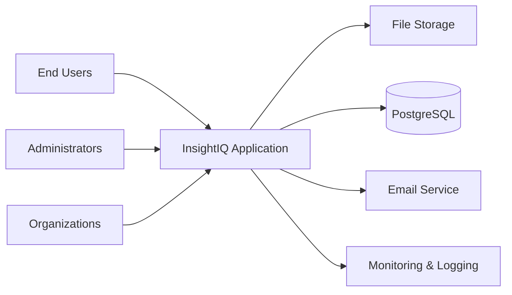
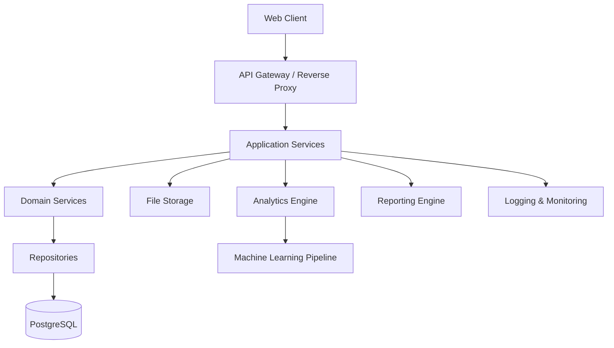
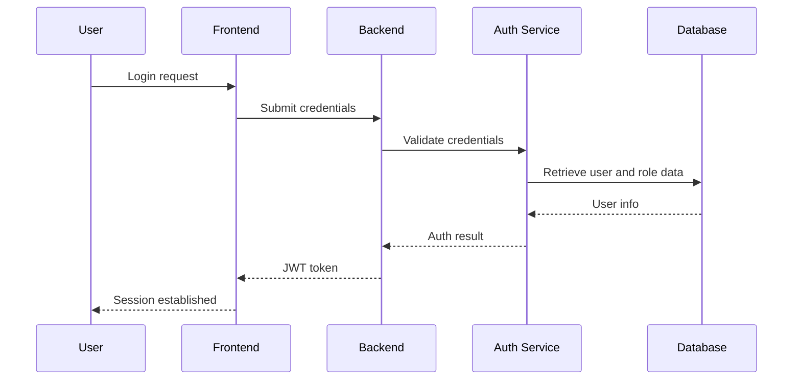
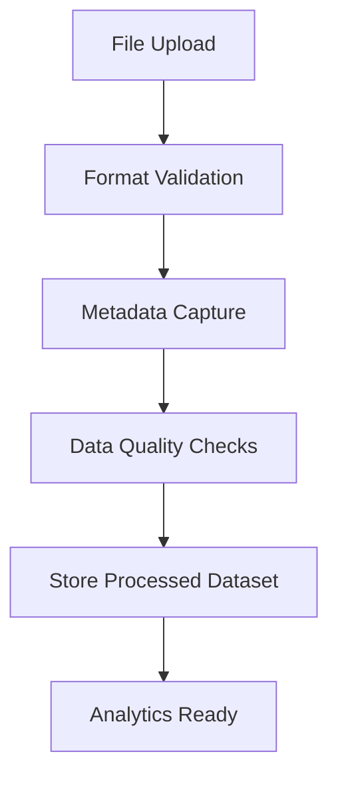
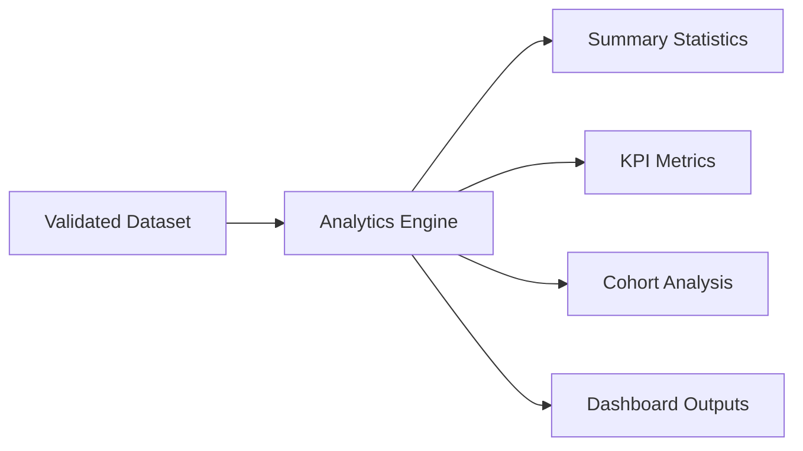
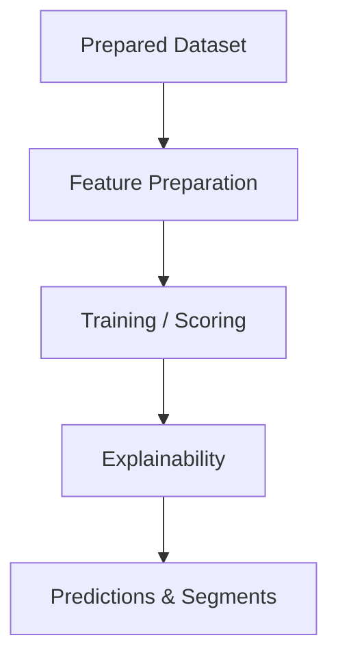
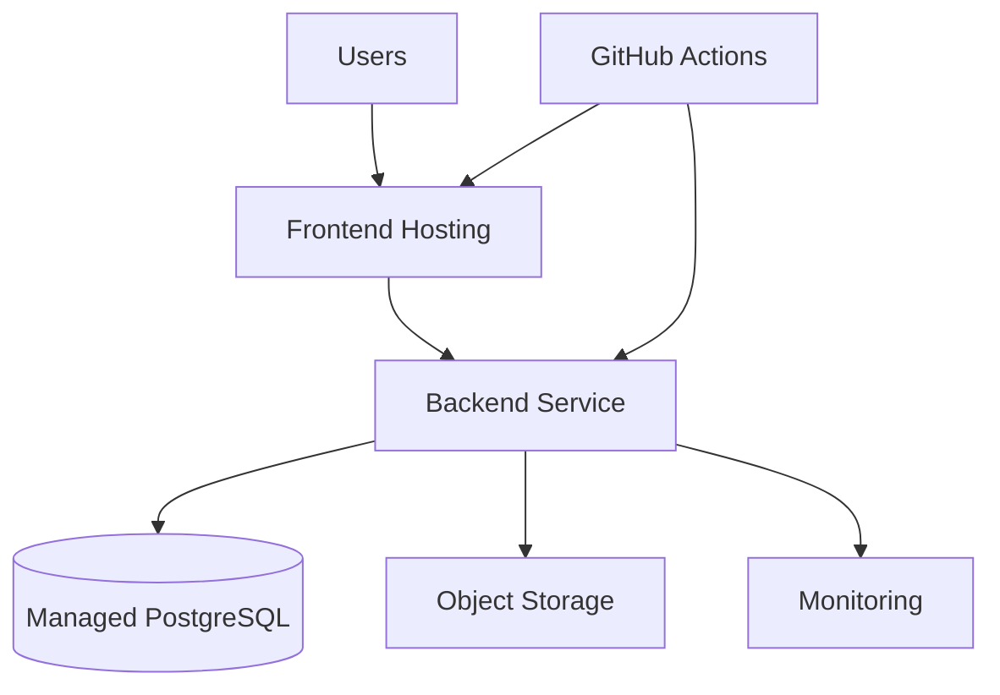

# System Architecture

## 1. Executive Summary

InsightIQ is a cloud-native enterprise SaaS platform designed to ingest customer datasets, validate and transform them, generate analytical insights, support predictive analytics, and deliver business reports. The system architecture emphasizes modularity, security, scalability, and maintainability while remaining adaptable for future AI-driven capabilities.

The design follows a layered and domain-oriented approach that separates user experience, application services, domain logic, data processing, analytics workflows, and infrastructure concerns. This promotes independent evolution of core capabilities such as authentication, dataset management, data quality, analytics, machine learning, and reporting.

---

## 2. Architectural Goals

The architecture is intended to achieve the following objectives:

- Support secure multi-tenant enterprise usage with role-based access control
- Enable scalable ingestion and processing of customer datasets
- Separate domain logic from infrastructure concerns using clean architecture boundaries
- Support analytics and ML workloads without tightly coupling them to the web application
- Provide extensibility for future AI assistants, integrations, and advanced predictive features
- Ensure maintainability, observability, and reliability in production environments

---

## 3. Design Principles

The architecture is governed by the following design principles:

- Clean Architecture: business rules remain isolated from delivery frameworks and infrastructure
- Layered Architecture: responsibilities are distributed across presentation, application, domain, and infrastructure layers
- Domain-Driven Design: core business capabilities are modeled around domain concepts such as Organization, Dataset, Analysis, Report, and Prediction
- SOLID Principles: each component has a focused responsibility and clear dependency direction
- Repository Pattern: persistence concerns are abstracted behind repositories
- Dependency Injection: infrastructure and service dependencies are injected rather than hard-wired
- Separation of Concerns: analytics, authentication, file processing, and reporting are treated as independent capabilities
- Evolvability: the system is designed to accommodate future AI and integration modules with minimal refactoring

---

## 4. System Context

InsightIQ operates as a cloud-based platform that interacts with several external and internal actors:

- End users such as analysts, business users, and administrators
- Organizations that manage datasets and operational permissions
- External storage or file transfer services for uploads
- Email services for verification and notifications
- Monitoring and observability platforms
- Cloud infrastructure for hosting, scaling, and deployment

### System Context Diagram

---

## 5. High-Level Architecture Overview

The system is composed of the following major building blocks:

- Presentation Layer: web client and user-facing experience
- Application Layer: orchestration of workflows, use cases, and service coordination
- Domain Layer: business rules, entities, value objects, and domain services
- Infrastructure Layer: persistence, storage, messaging, external integrations, and deployment concerns
- Analytics Layer: EDA, KPI, cohort, and reporting services
- Machine Learning Layer: segmentation, churn, forecasting, and explainability modules

The architecture is designed to support both synchronous interactive workflows and asynchronous long-running background processing.

### High-Level Architecture Diagram

---

## 6. Layered Architecture

### Presentation Layer

Purpose:
- Deliver the user experience through a web application

Responsibilities:
- Render dashboards, workflow pages, and reporting interfaces
- Collect user input and route navigation
- Handle client-side state and request orchestration

Dependencies:
- Application services exposed over the network
- Authentication and authorization context

Inputs:
- User interaction events

Outputs:
- User actions and UI rendering updates

Failure Handling:
- Display user-friendly error states and retry guidance

### Application Layer

Purpose:
- Coordinate business workflows and use cases

Responsibilities:
- Orchestrate authentication, dataset processing, analysis execution, and reporting workflows
- Apply cross-cutting concerns such as validation and transaction boundaries
- Coordinate services without embedding persistence logic

Dependencies:
- Domain services, repositories, analytics services, ML services, and infrastructure adapters

Inputs:
- User requests and internal workflow triggers

Outputs:
- Command results, process status, and generated artifacts

Failure Handling:
- Return controlled errors and queue recoverable work for background processing

### Domain Layer

Purpose:
- Encapsulate core business rules and business logic

Responsibilities:
- Define domain entities and business rules for organizations, datasets, analyses, predictions, and reports
- Maintain invariants and enforce policy decisions
- Provide reusable domain services for analytics orchestration

Dependencies:
- None or only abstractions from the infrastructure layer

Inputs:
- Domain commands and workflow requests

Outputs:
- Domain events, validated results, and derived business objects

Failure Handling:
- Reject invalid domain operations and raise structured domain errors

### Infrastructure Layer

Purpose:
- Provide technical implementations required by the domain and application layers

Responsibilities:
- Persist entities and relationships
- Manage file storage, queues, telemetry, and external integration adapters
- Implement security, identity, and notification integrations

Dependencies:
- Persistence engines, cloud services, external systems

Inputs:
- Infrastructure requests from application services

Outputs:
- Stored data, generated artifacts, and integration responses

Failure Handling:
- Retry transient failures and surface long-running issues to the application layer

---

## 7. Frontend Architecture

### Purpose

Provide a responsive and secure user interface for business and technical users to interact with datasets, analytics, reports, and administration features.

### Responsibilities

- Present user journeys for onboarding, upload, analysis, dashboarding, and reporting
- Apply role-based navigation and feature access control
- Communicate with backend services using secure API patterns
- Support state synchronization for asynchronous jobs and dashboard content

### Dependencies

- Backend application services
- Authentication services
- File upload endpoints
- Analytics and reporting services

### Inputs

- User interactions, navigation events, and data requests

### Outputs

- Data requests, workflow actions, and rendered analytics views

### Failure Handling

- Show clear error messaging, retry support, and status indicators for long-running processes

---

## 8. Backend Architecture

### Purpose

Act as the primary application server that coordinates domain workflows and interfaces with persistence, analytics, file storage, and security subsystems.

### Responsibilities

- Expose application endpoints to the frontend and other consumers
- Orchestrate use cases such as login, upload, validation, analysis, reporting, and administration
- Apply domain rules and enforce access control
- Trigger analytics jobs and manage background processing

### Dependencies

- Authentication services
- Repository layer
- Analytics engine
- ML pipeline
- Reporting module
- Logging and monitoring services

### Inputs

- User requests and scheduled or event-driven tasks

### Outputs

- Process results, data summaries, generated artifacts, and status responses

### Failure Handling

- Return structured error responses, escalate critical failures, and preserve failed-job state for later recovery

---

## 9. Authentication Architecture

### Purpose

Protect access to the platform and ensure that users, roles, and sessions are managed securely.

### Responsibilities

- Authenticate users through secure identity workflows
- Issue and validate JWT-based tokens
- Enforce role-based access control and permission checks
- Support verification, password recovery, and session validity processes

### Dependencies

- Identity data in the database
- Security libraries and token validation components
- Email service for verification and recovery notifications

### Inputs

- User credentials, token requests, and identity state

### Outputs

- Authenticated sessions, access decisions, and security events

### Failure Handling

- Reject invalid credentials, expire tokens gracefully, and log suspicious activity

### Authentication Flow Diagram

---

## 10. Data Processing Pipeline

### Purpose

Transform uploaded datasets into validated, analyzable data artifacts that can support analytics and reporting.

### Responsibilities

- Receive uploaded files and validate format and structure
- Capture metadata and maintain dataset versioning
- Perform quality checks such as missing values, duplicates, invalid types, and outliers
- Generate a data quality score and structured processing results
- Store artifacts for downstream analytics and reporting

### Dependencies

- File storage system
- Validation services
- Metadata repositories
- Processing job orchestration

### Inputs

- Uploaded CSV or Excel files

### Outputs

- Normalized datasets, validation summaries, and quality metrics

### Failure Handling

- Reject malformed files, isolate invalid records where possible, and preserve error state for investigation

### Dataset Processing Flow Diagram

---

## 11. Analytics Engine

### Purpose

Generate business insights from validated datasets for dashboards, KPIs, cohorts, and trend analysis.

### Responsibilities

- Compute summary statistics and descriptive analytics
- Produce KPI views for customer, revenue, retention, and cohort metrics
- Support analytical operations that are reusable across multiple user workflows
- Provide a consistent analytical foundation for reports and dashboards

### Dependencies

- Processed datasets
- Domain services and repositories
- Reporting engine

### Inputs

- Dataset versions, filters, and analytical parameters

### Outputs

- Analytical summaries, trend views, and dashboard-ready metrics

### Failure Handling

- Report missing inputs, prevent invalid analyses, and return partial results where appropriate

### Analytics Pipeline Diagram

---

## 12. Machine Learning Pipeline

### Purpose

Support predictive and segmentation workflows required for churn prediction, revenue forecasting, customer segmentation, and customer lifetime value estimation.

### Responsibilities

- Prepare training and inference datasets
- Execute model training and scoring workflows
- Generate explainability outputs for supported models
- Store model artifacts and execution metadata

### Dependencies

- Validated datasets and feature preparation services
- ML libraries and model management components
- Analytics services for result interpretation

### Inputs

- Prepared datasets, model configuration, and execution parameters

### Outputs

- Segments, predictions, confidence values, explanations, and forecast outputs

### Failure Handling

- Halt invalid model runs, surface training failures, and avoid presenting unsupported outputs as authoritative decisions

### ML Pipeline Diagram

---

## 13. Database Architecture

### Purpose

Provide persistent storage for users, organizations, datasets, analytics metadata, reports, and audit information.

### Responsibilities

- Store transactional application data with integrity and consistency
- Support audit trails and historical records
- Enable efficient queries for dashboards, reports, and access control
- Maintain relationships between organizations, users, datasets, analyses, and reports

### Dependencies

- Database engine and backup infrastructure
- Repository implementations

### Inputs

- Application and domain writes

### Outputs

- Query results, persisted records, and historical state

### Failure Handling

- Enforce transactional boundaries, support recovery, and protect against data corruption

### Database Architecture Characteristics

- PostgreSQL as the primary transactional store
- Logical separation of operational, analytical, and reporting concerns where needed in future growth
- Support for version history and immutable audit records

---

## 14. Reporting Engine

### Purpose

Produce downloadable and shareable business reports from validated analytics outputs.

### Responsibilities

- Assemble report content from analytics results and metadata
- Render report packages in PDF and Excel formats
- Maintain a history of report generation requests and artifacts

### Dependencies

- Analytics engine
- File generation services
- Storage systems

### Inputs

- Selected analytics results, filters, and report templates

### Outputs

- Downloadable reports and report metadata

### Failure Handling

- Gracefully handle export failures and preserve generation state for retries

---

## 15. File Storage Strategy

### Purpose

Store uploaded datasets, generated artifacts, reports, and supporting files in a secure and scalable manner.

### Responsibilities

- Manage file ingestion, validation, and storage lifecycle
- Preserve dataset versions and generated outputs
- Apply access controls and retention policies to stored files

### Dependencies

- Cloud storage service or object storage backend
- Application services and metadata repositories

### Inputs

- User uploads and generated artifacts

### Outputs

- Stored file references and artifact metadata

### Failure Handling

- Handle storage failures, duplicate uploads, and partial writes safely

---

## 16. Logging & Monitoring

### Purpose

Provide observability into application health, processing status, security events, and operational performance.

### Responsibilities

- Capture structured logs for application, security, and analytics activities
- Expose health and performance telemetry
- Trigger alerts for operational anomalies and service degradation

### Dependencies

- Logging infrastructure, monitoring services, and deployment environment

### Inputs

- Application events, processing events, and infrastructure signals

### Outputs

- Dashboards, alerts, logs, and incident response data

### Failure Handling

- Degrade gracefully, preserve logs, and support troubleshooting through correlated events

---

## 17. Security Architecture

### Purpose

Protect platform data, users, services, and operations against unauthorized access and misuse.

### Responsibilities

- Enforce authentication and authorization
- Protect data in transit and at rest where applicable
- Apply least-privilege access and audit controls
- Support tenant separation and sensitive data handling practices

### Dependencies

- Identity and access mechanisms
- Secure storage and encryption services
- Platform monitoring and audit logging

### Inputs

- Authentication requests, access policies, and configuration data

### Outputs

- Access decisions, audit records, and policy enforcement outcomes

### Failure Handling

- Block unauthorized actions, log suspicious activity, and preserve security events

### Security Considerations

- JWT-based authentication
- Role-based access control
- Secure handling of secrets and environment configuration
- Audit logs for privileged actions
- Data isolation between organizations and workspaces

---

## 18. Scalability Strategy

The architecture is designed for scale through modular decomposition, stateless service patterns, asynchronous task execution, and the ability to extend individual capabilities independently.

### Scalability Approach

- Frontend and backend services can scale independently based on demand
- Long-running analytics and modeling tasks can be processed asynchronously
- Storage and processing layers can evolve independently for larger workloads
- The architecture allows future introduction of queue-based or event-driven processing without major redesign

---

## 19. Performance Considerations

Performance will be shaped by the following architectural decisions:

- Asynchronous processing for large datasets and long-running analytics
- Caching of frequently used metadata and dashboard summaries where appropriate
- Separation of interactive requests from heavy analytical workloads
- Efficient data preparation and reduction before rendering large analytics views

---

## 20. Error Handling Strategy

The system will handle errors using layered and consistent practices:

- Domain layer: reject invalid states and preserve business rule integrity
- Application layer: capture and translate failures into meaningful workflows
- Infrastructure layer: retry transient errors and isolate persistent failures
- UX layer: present understandable messages and status information

Error handling will include retries, idempotency where appropriate, validation feedback, and structured logging for root-cause analysis.

---

## 21. Deployment Architecture

### Purpose

Provide a production-ready deployment model for the platform that supports resilience, maintainability, and operational visibility.

### Deployment Model

- Frontend deployed on a modern hosting platform suitable for static and dynamic web workloads
- Backend deployed as a containerized service on a managed cloud platform
- PostgreSQL hosted as a managed database service
- File storage deployed through a managed object storage service
- CI/CD pipelines executed through GitHub Actions

### Deployment Architecture Diagram

---

## 22. Technology Decisions

| Area | Decision | Rationale |
|---|---|---|
| Frontend | React + TypeScript + Vite | Modern developer experience and rapid iteration |
| Backend | Python + FastAPI | Strong analytics and ML ecosystem integration |
| Data Access | SQLAlchemy + repository pattern | Maintainable persistence abstraction |
| Validation | Pydantic v2 | Strong schema validation and type safety |
| Database | PostgreSQL | Reliability, relational integrity, and broad ecosystem support |
| ML Stack | Scikit-learn, XGBoost, LightGBM | Mature and widely adopted analytics libraries |
| Deployment | Docker + container-based hosting | Consistent environments and portability |
| Authentication | JWT + RBAC | Standard enterprise security approach |

---

## 23. Risks & Trade-offs

| Risk / Trade-off | Description |
|---|---|
| Complexity vs. speed | Introducing modularity and clean architecture may increase initial setup effort |
| Analytical workload cost | ML and analytics jobs may be resource-intensive and require asynchronous execution |
| Security vs. usability | Strong access control can increase friction for some users |
| Standardization vs. flexibility | Common services may need extension points to support future custom use cases |
| Cloud dependency | Managed services can simplify operations but introduce provider dependency |

---

## 24. Future Expansion

The architecture is intended to support future growth in several directions:

- Add AI-driven assistants and natural language analytics capabilities
- Expand integrations with CRM, ERP, and external warehousing platforms
- Introduce event-driven processing for near-real-time analytics workflows
- Support advanced governance, data residency, and enterprise policy controls
- Scale analytics processing independently for larger enterprise workloads

---

## Quality Attributes

### Maintainability

The architecture separates concerns across layers and domains, reducing coupling and enabling targeted changes without widespread impact.

### Scalability

The use of modular services, asynchronous processing, and independent service growth paths supports growth in users and workloads.

### Security

Authentication, authorization, audit logging, and data boundaries are incorporated into the architecture to protect enterprise workloads.

### Availability

The design supports resilient deployment, monitoring, and graceful failure handling to protect continuity of operations.

### Performance

The architecture accounts for asynchronous processing and output optimization to support interactive and analytical workloads.

### Extensibility

The layered design and domain-oriented boundaries make it practical to add new analytics modules, ML workflows, and integrations.

### Reliability

Transactional boundaries, structured error handling, and health monitoring support dependable operation.

### Testability

The architecture supports isolated testing of domain logic, services, and integration boundaries through clear abstractions and dependency injection.
