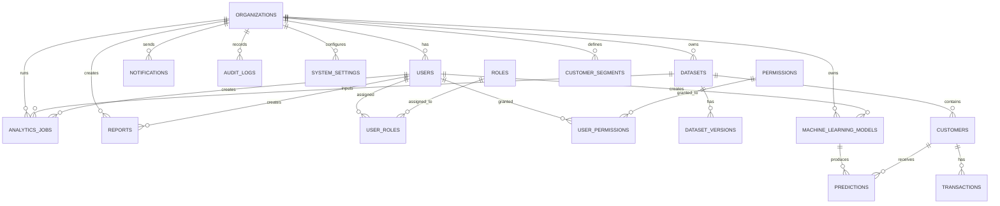

# Database Design

## 1. Overview

This document defines the logical and physical database design for the InsightIQ platform using PostgreSQL. The design follows a normalized relational model aligned with Third Normal Form (3NF) and supports enterprise SaaS requirements such as multi-tenancy, auditability, soft deletion, extensibility, and analytics readiness.

The database is designed to support core platform modules including authentication, organizations, users, datasets, analytics jobs, machine learning artifacts, predictions, reports, notifications, audit logs, and system settings.

---

## 2. Design Goals

- Support multi-tenant enterprise usage through organization-based isolation
- Normalize data to reduce redundancy and improve consistency
- Support auditability and traceability for every significant action
- Allow versioning of datasets and analytical artifacts
- Support future analytics and machine learning extension without redesign
- Use UUID primary keys where practical for distributed and SaaS-friendly identity management
- Apply soft deletes for historical integrity and recovery scenarios

---

## 3. Design Principles

- Use 3NF as the baseline for relational modeling
- Separate reference data from transactional data
- Use foreign keys to enforce referential integrity
- Preserve immutable audit history where appropriate
- Use soft delete flags instead of hard deletion for core business records
- Use descriptive naming conventions and consistent schema organization
- Apply indexes based on query patterns, joins, and reporting needs

---

## 4. Naming Conventions

### Table Names

- Use lowercase snake_case
- Use singular or plural consistently, preferably plural for entity collections
- Example: users, organizations, datasets, analytics_jobs

### Column Names

- Use lowercase snake_case
- Prefer descriptive names over abbreviations
- Example: created_at, updated_at, deleted_at

### Foreign Keys

- Use the pattern <table>_id
- Example: organization_id, created_by_user_id

### Indexes

- Use the pattern idx_<table>_<column(s)>
- Example: idx_users_email, idx_datasets_organization_id

### Constraints

- Use descriptive names such as uq_users_email_org, ck_users_status

---

## 5. Core Design Assumptions

- PostgreSQL is the primary operational database
- UUIDs are used for primary keys on core business entities to support distributed scaling and easier integration
- All timestamp fields are stored in UTC
- Soft delete is used for user-facing business entities such as organizations, users, datasets, reports, and models
- Audit logs are append-only and are not soft deleted
- The system supports one organization per user account in the MVP, with future extension to more complex multi-tenant roles

---

## 6. Logical Entity Model

The core domain entities are:

- organizations
- roles
- permissions
- users
- user_roles
- user_permissions
- datasets
- dataset_versions
- customers
- transactions
- analytics_jobs
- machine_learning_models
- predictions
- customer_segments
- reports
- notifications
- audit_logs
- system_settings

---

## 7. Table Specifications

### 7.1 organizations

Purpose:
- Represents a tenant or business entity using the platform.

| Column | Type | PK | FK | Nullable | Default | Notes |
|---|---|---|---|---|---|---|
| id | UUID | Yes | No | No | gen_random_uuid() | Primary key |
| name | VARCHAR(255) | No | No | No | — | Organization name |
| slug | VARCHAR(100) | No | No | No | — | Unique tenant slug |
| industry | VARCHAR(100) | No | No | Yes | — | Optional industry classification |
| status | VARCHAR(50) | No | No | No | 'active' | Active, suspended, archived |
| settings_json | JSONB | No | No | Yes | '{}' | Tenant configuration |
| created_at | TIMESTAMPTZ | No | No | No | now() | Creation timestamp |
| updated_at | TIMESTAMPTZ | No | No | No | now() | Update timestamp |
| deleted_at | TIMESTAMPTZ | No | No | Yes | — | Soft delete timestamp |

Primary Key:
- id

Unique Constraints:
- uq_organizations_slug on slug where deleted_at is null

Indexes:
- idx_organizations_status
- idx_organizations_created_at

Business Rules:
- Organization slugs must be unique among active organizations.
- Deleted organizations remain in history but are excluded from active usage.

---

### 7.2 roles

Purpose:
- Defines system roles used for RBAC.

| Column | Type | PK | FK | Nullable | Default | Notes |
|---|---|---|---|---|---|---|
| id | UUID | Yes | No | No | gen_random_uuid() | Primary key |
| name | VARCHAR(100) | No | No | No | — | Role name |
| description | TEXT | No | No | Yes | — | Human readable description |
| is_system_role | BOOLEAN | No | No | No | false | Reserved system roles |
| created_at | TIMESTAMPTZ | No | No | No | now() | Creation timestamp |
| updated_at | TIMESTAMPTZ | No | No | No | now() | Update timestamp |
| deleted_at | TIMESTAMPTZ | No | No | Yes | — | Soft delete timestamp |

Primary Key:
- id

Unique Constraints:
- uq_roles_name on name where deleted_at is null

Indexes:
- idx_roles_name

Business Rules:
- System roles cannot be deleted in normal operations.

---

### 7.3 permissions

Purpose:
- Stores permission definitions used for authorization.

| Column | Type | PK | FK | Nullable | Default | Notes |
|---|---|---|---|---|---|---|
| id | UUID | Yes | No | No | gen_random_uuid() | Primary key |
| code | VARCHAR(100) | No | No | No | — | Permission code |
| description | TEXT | No | No | Yes | — | Permission description |
| created_at | TIMESTAMPTZ | No | No | No | now() | Creation timestamp |
| updated_at | TIMESTAMPTZ | No | No | No | now() | Update timestamp |

Primary Key:
- id

Unique Constraints:
- uq_permissions_code on code

Indexes:
- idx_permissions_code

Business Rules:
- Permissions should be immutable once assigned to roles and users in production.

---

### 7.4 users

Purpose:
- Represents application users.

| Column | Type | PK | FK | Nullable | Default | Notes |
|---|---|---|---|---|---|---|
| id | UUID | Yes | No | No | gen_random_uuid() | Primary key |
| organization_id | UUID | No | Yes | No | — | References organizations |
| email | VARCHAR(255) | No | No | No | — | Unique user email |
| full_name | VARCHAR(255) | No | No | No | — | User display name |
| password_hash | VARCHAR(255) | No | No | No | — | Secure password hash |
| status | VARCHAR(50) | No | No | No | 'pending' | active, inactive, locked, pending |
| is_email_verified | BOOLEAN | No | No | No | false | Verification flag |
| last_login_at | TIMESTAMPTZ | No | No | Yes | — | Last successful login |
| created_at | TIMESTAMPTZ | No | No | No | now() | Creation timestamp |
| updated_at | TIMESTAMPTZ | No | No | No | now() | Update timestamp |
| deleted_at | TIMESTAMPTZ | No | No | Yes | — | Soft delete timestamp |

Primary Key:
- id

Foreign Keys:
- organization_id -> organizations(id)

Unique Constraints:
- uq_users_email_org on (organization_id, email) where deleted_at is null

Indexes:
- idx_users_organization_id
- idx_users_email
- idx_users_status
- idx_users_last_login_at

Business Rules:
- Each user belongs to one organization.
- Email must be unique within an organization.
- Inactive or locked users cannot authenticate.

---

### 7.5 user_roles

Purpose:
- Associates users to roles using a join table.

| Column | Type | PK | FK | Nullable | Default | Notes |
|---|---|---|---|---|---|---|
| id | UUID | Yes | No | No | gen_random_uuid() | Primary key |
| user_id | UUID | No | Yes | No | — | References users |
| role_id | UUID | No | Yes | No | — | References roles |
| created_at | TIMESTAMPTZ | No | No | No | now() | Creation timestamp |

Primary Key:
- id

Foreign Keys:
- user_id -> users(id)
- role_id -> roles(id)

Unique Constraints:
- uq_user_roles_user_role on (user_id, role_id)

Indexes:
- idx_user_roles_user_id
- idx_user_roles_role_id

Business Rules:
- A user may have multiple roles, but duplicate assignments are prohibited.

---

### 7.6 user_permissions

Purpose:
- Stores explicit permission grants to users when needed beyond role-based access.

| Column | Type | PK | FK | Nullable | Default | Notes |
|---|---|---|---|---|---|---| 
| id | UUID | Yes | No | No | gen_random_uuid() | Primary key |
| user_id | UUID | No | Yes | No | — | References users |
| permission_id | UUID | No | Yes | No | — | References permissions |
| granted_at | TIMESTAMPTZ | No | No | No | now() | Grant timestamp |

Primary Key:
- id

Foreign Keys:
- user_id -> users(id)
- permission_id -> permissions(id)

Unique Constraints:
- uq_user_permissions_user_permission on (user_id, permission_id)

Indexes:
- idx_user_permissions_user_id
- idx_user_permissions_permission_id

Business Rules:
- Explicit user permissions should be used sparingly and only for exceptional access cases.

---

### 7.7 datasets

Purpose:
- Stores dataset metadata and high-level status information.

| Column | Type | PK | FK | Nullable | Default | Notes |
|---|---|---|---|---|---|---|
| id | UUID | Yes | No | No | gen_random_uuid() | Primary key |
| organization_id | UUID | No | Yes | No | — | Tenant reference |
| created_by_user_id | UUID | No | Yes | No | — | Uploading user |
| name | VARCHAR(255) | No | No | No | — | Dataset name |
| file_name | VARCHAR(255) | No | No | No | — | Original file name |
| file_type | VARCHAR(50) | No | No | No | — | csv, xlsx |
| storage_path | TEXT | No | No | No | — | File storage reference |
| file_size_bytes | BIGINT | No | No | Yes | — | File size |
| row_count | BIGINT | No | No | Yes | — | Row count after import |
| column_count | INTEGER | No | No | Yes | — | Column count |
| status | VARCHAR(50) | No | No | No | 'uploaded' | uploaded, validating, ready, failed |
| quality_score | NUMERIC(5,2) | No | No | Yes | — | Data quality score |
| description | TEXT | No | No | Yes | — | User-provided description |
| created_at | TIMESTAMPTZ | No | No | No | now() | Creation timestamp |
| updated_at | TIMESTAMPTZ | No | No | No | now() | Update timestamp |
| deleted_at | TIMESTAMPTZ | No | No | Yes | — | Soft delete timestamp |

Primary Key:
- id

Foreign Keys:
- organization_id -> organizations(id)
- created_by_user_id -> users(id)

Unique Constraints:
- uq_datasets_org_name on (organization_id, name, deleted_at) where deleted_at is null

Indexes:
- idx_datasets_organization_id
- idx_datasets_created_by_user_id
- idx_datasets_status
- idx_datasets_created_at

Business Rules:
- Dataset names must be unique within an organization for active records.
- Uploaded files must be stored in an approved location and referenced securely.

---

### 7.8 dataset_versions

Purpose:
- Stores dataset revisions and version history.

| Column | Type | PK | FK | Nullable | Default | Notes |
|---|---|---|---|---|---|---|
| id | UUID | Yes | No | No | gen_random_uuid() | Primary key |
| dataset_id | UUID | No | Yes | No | — | References datasets |
| version_number | INTEGER | No | No | No | 1 | Version number |
| status | VARCHAR(50) | No | No | No | 'draft' | draft, active, archived |
| change_summary | TEXT | No | No | Yes | — | Summary of changes |
| storage_path | TEXT | No | No | No | — | Version-specific storage reference |
| created_at | TIMESTAMPTZ | No | No | No | now() | Creation timestamp |
| created_by_user_id | UUID | No | Yes | No | — | User who created the version |
| deleted_at | TIMESTAMPTZ | No | No | Yes | — | Soft delete timestamp |

Primary Key:
- id

Foreign Keys:
- dataset_id -> datasets(id)
- created_by_user_id -> users(id)

Unique Constraints:
- uq_dataset_versions_dataset_version on (dataset_id, version_number)

Indexes:
- idx_dataset_versions_dataset_id
- idx_dataset_versions_status
- idx_dataset_versions_created_at

Business Rules:
- Each dataset may have multiple versions, but version numbers are unique within a dataset.
- One version may be marked as active for analytical use.

---

### 7.9 customers

Purpose:
- Stores customer-level records imported from datasets.

| Column | Type | PK | FK | Nullable | Default | Notes |
|---|---|---|---|---|---|---|
| id | UUID | Yes | No | No | gen_random_uuid() | Primary key |
| organization_id | UUID | No | Yes | No | — | Tenant reference |
| dataset_id | UUID | No | Yes | No | — | Source dataset |
| customer_key | VARCHAR(255) | No | No | No | — | Business identifier |
| first_name | VARCHAR(255) | No | No | Yes | — | Optional |
| last_name | VARCHAR(255) | No | No | Yes | — | Optional |
| email | VARCHAR(255) | No | No | Yes | — | Optional |
| signup_date | DATE | No | No | Yes | — | Customer signup date |
| status | VARCHAR(50) | No | No | No | 'active' | Active, inactive, churned |
| created_at | TIMESTAMPTZ | No | No | No | now() | Creation timestamp |
| updated_at | TIMESTAMPTZ | No | No | No | now() | Update timestamp |
| deleted_at | TIMESTAMPTZ | No | No | Yes | — | Soft delete timestamp |

Primary Key:
- id

Foreign Keys:
- organization_id -> organizations(id)
- dataset_id -> datasets(id)

Unique Constraints:
- uq_customers_org_dataset_key on (organization_id, dataset_id, customer_key)

Indexes:
- idx_customers_organization_id
- idx_customers_dataset_id
- idx_customers_status
- idx_customers_signup_date

Business Rules:
- Customer identifiers should be unique within the dataset and organization context.
- Customer records should be associated with a known source dataset.

---

### 7.10 transactions

Purpose:
- Stores transaction-level financial activity for revenue and customer lifetime value analysis.

| Column | Type | PK | FK | Nullable | Default | Notes |
|---|---|---|---|---|---|---|
| id | UUID | Yes | No | No | gen_random_uuid() | Primary key |
| organization_id | UUID | No | Yes | No | — | Tenant reference |
| customer_id | UUID | No | Yes | No | — | Reference to customer |
| transaction_date | DATE | No | No | No | — | Transaction date |
| amount | NUMERIC(12,2) | No | No | No | 0.00 | Revenue amount |
| currency | VARCHAR(10) | No | No | No | 'USD' | Currency code |
| transaction_type | VARCHAR(50) | No | No | Yes | — | Purchase, refund, fee |
| created_at | TIMESTAMPTZ | No | No | No | now() | Creation timestamp |
| updated_at | TIMESTAMPTZ | No | No | No | now() | Update timestamp |
| deleted_at | TIMESTAMPTZ | No | No | Yes | — | Soft delete timestamp |

Primary Key:
- id

Foreign Keys:
- organization_id -> organizations(id)
- customer_id -> customers(id)

Indexes:
- idx_transactions_customer_id
- idx_transactions_transaction_date
- idx_transactions_organization_id

Business Rules:
- Transaction amounts should be non-negative.
- Currency should be standardized where possible.

---

### 7.11 analytics_jobs

Purpose:
- Tracks long-running analytics and processing executions.

| Column | Type | PK | FK | Nullable | Default | Notes |
|---|---|---|---|---|---|---|
| id | UUID | Yes | No | No | gen_random_uuid() | Primary key |
| organization_id | UUID | No | Yes | No | — | Tenant reference |
| created_by_user_id | UUID | No | Yes | No | — | User that initiated the job |
| job_type | VARCHAR(100) | No | No | No | — | EDA, segmentation, churn, forecast |
| status | VARCHAR(50) | No | No | No | 'queued' | queued, running, completed, failed |
| input_dataset_id | UUID | No | Yes | Yes | — | Source dataset |
| output_reference | TEXT | No | No | Yes | — | Output artifact reference |
| started_at | TIMESTAMPTZ | No | No | Yes | — | Start timestamp |
| completed_at | TIMESTAMPTZ | No | No | Yes | — | Completion timestamp |
| error_message | TEXT | No | No | Yes | — | Failure details |
| created_at | TIMESTAMPTZ | No | No | No | now() | Creation timestamp |
| updated_at | TIMESTAMPTZ | No | No | No | now() | Update timestamp |

Primary Key:
- id

Foreign Keys:
- organization_id -> organizations(id)
- created_by_user_id -> users(id)
- input_dataset_id -> datasets(id)

Indexes:
- idx_analytics_jobs_organization_id
- idx_analytics_jobs_status
- idx_analytics_jobs_created_at
- idx_analytics_jobs_job_type

Business Rules:
- Jobs must be associated with a tenant and a valid initiating user.
- Failed jobs retain error metadata for troubleshooting.

---

### 7.12 machine_learning_models

Purpose:
- Stores metadata for generated machine learning models.

| Column | Type | PK | FK | Nullable | Default | Notes |
|---|---|---|---|---|---|---|
| id | UUID | Yes | No | No | gen_random_uuid() | Primary key |
| organization_id | UUID | No | Yes | No | — | Tenant reference |
| created_by_user_id | UUID | No | Yes | No | — | Creator |
| model_name | VARCHAR(255) | No | No | No | — | Model name |
| model_type | VARCHAR(100) | No | No | No | — | churn, segmentation, forecast |
| algorithm | VARCHAR(100) | No | No | Yes | — | Library or algorithm |
| version | VARCHAR(50) | No | No | No | '1.0' | Model version |
| artifact_path | TEXT | No | No | Yes | — | Model artifact reference |
| is_active | BOOLEAN | No | No | No | true | Active model indicator |
| created_at | TIMESTAMPTZ | No | No | No | now() | Creation timestamp |
| updated_at | TIMESTAMPTZ | No | No | No | now() | Update timestamp |
| deleted_at | TIMESTAMPTZ | No | No | Yes | — | Soft delete timestamp |

Primary Key:
- id

Foreign Keys:
- organization_id -> organizations(id)
- created_by_user_id -> users(id)

Unique Constraints:
- uq_models_org_name_version on (organization_id, model_name, version)

Indexes:
- idx_machine_learning_models_organization_id
- idx_machine_learning_models_model_type
- idx_machine_learning_models_is_active

Business Rules:
- Only one active model per logical model name may be used for a production workflow.

---

### 7.13 predictions

Purpose:
- Stores outputs from predictive analytics tasks.

| Column | Type | PK | FK | Nullable | Default | Notes |
|---|---|---|---|---|---|---|
| id | UUID | Yes | No | No | gen_random_uuid() | Primary key |
| organization_id | UUID | No | Yes | No | — | Tenant reference |
| model_id | UUID | No | Yes | No | — | Associated model |
| customer_id | UUID | No | Yes | No | — | Related customer |
| prediction_type | VARCHAR(100) | No | No | No | — | churn, forecast, score |
| score | NUMERIC(10,6) | No | No | Yes | — | Prediction score |
| label | VARCHAR(100) | No | No | Yes | — | Predicted label |
| explanation_json | JSONB | No | No | Yes | '{}' | Explainability metadata |
| created_at | TIMESTAMPTZ | No | No | No | now() | Creation timestamp |
| updated_at | TIMESTAMPTZ | No | No | No | now() | Update timestamp |

Primary Key:
- id

Foreign Keys:
- organization_id -> organizations(id)
- model_id -> machine_learning_models(id)
- customer_id -> customers(id)

Indexes:
- idx_predictions_customer_id
- idx_predictions_model_id
- idx_predictions_prediction_type
- idx_predictions_created_at

Business Rules:
- Prediction outputs must be tied to a defined model instance and customer context.

---

### 7.14 customer_segments

Purpose:
- Stores segment definitions and associated segment membership summary data.

| Column | Type | PK | FK | Nullable | Default | Notes |
|---|---|---|---|---|---|---|
| id | UUID | Yes | No | No | gen_random_uuid() | Primary key |
| organization_id | UUID | No | Yes | No | — | Tenant reference |
| name | VARCHAR(255) | No | No | No | — | Segment name |
| description | TEXT | No | No | Yes | — | Segment description |
| criteria_json | JSONB | No | No | No | '{}' | Segment logic |
| created_at | TIMESTAMPTZ | No | No | No | now() | Creation timestamp |
| updated_at | TIMESTAMPTZ | No | No | No | now() | Update timestamp |
| deleted_at | TIMESTAMPTZ | No | No | Yes | — | Soft delete timestamp |

Primary Key:
- id

Foreign Keys:
- organization_id -> organizations(id)

Unique Constraints:
- uq_customer_segments_org_name on (organization_id, name) where deleted_at is null

Indexes:
- idx_customer_segments_organization_id
- idx_customer_segments_name

Business Rules:
- Segment names should be unique within an organization for active records.

---

### 7.15 reports

Purpose:
- Stores report metadata and export status.

| Column | Type | PK | FK | Nullable | Default | Notes |
|---|---|---|---|---|---|---|
| id | UUID | Yes | No | No | gen_random_uuid() | Primary key |
| organization_id | UUID | No | Yes | No | — | Tenant reference |
| created_by_user_id | UUID | No | Yes | No | — | Creator |
| report_name | VARCHAR(255) | No | No | No | — | Report title |
| report_type | VARCHAR(100) | No | No | No | — | dashboard, analytics, executive |
| format | VARCHAR(50) | No | No | No | 'pdf' | pdf, excel |
| status | VARCHAR(50) | No | No | No | 'pending' | pending, generated, failed |
| storage_path | TEXT | No | No | Yes | — | Export artifact path |
| generated_at | TIMESTAMPTZ | No | No | Yes | — | Generation timestamp |
| created_at | TIMESTAMPTZ | No | No | No | now() | Creation timestamp |
| updated_at | TIMESTAMPTZ | No | No | No | now() | Update timestamp |
| deleted_at | TIMESTAMPTZ | No | No | Yes | — | Soft delete timestamp |

Primary Key:
- id

Foreign Keys:
- organization_id -> organizations(id)
- created_by_user_id -> users(id)

Indexes:
- idx_reports_organization_id
- idx_reports_created_by_user_id
- idx_reports_status
- idx_reports_generated_at

Business Rules:
- Reports must be associated with an organization and creator.

---

### 7.16 notifications

Purpose:
- Stores notification messages for users or system events.

| Column | Type | PK | FK | Nullable | Default | Notes |
|---|---|---|---|---|---|---|
| id | UUID | Yes | No | No | gen_random_uuid() | Primary key |
| organization_id | UUID | No | Yes | No | — | Tenant reference |
| user_id | UUID | No | Yes | Yes | — | Recipient user |
| notification_type | VARCHAR(100) | No | No | No | — | dataset_ready, model_complete |
| subject | VARCHAR(255) | No | No | No | — | Message title |
| message | TEXT | No | No | No | — | Notification content |
| is_read | BOOLEAN | No | No | No | false | Read state |
| created_at | TIMESTAMPTZ | No | No | No | now() | Creation timestamp |
| updated_at | TIMESTAMPTZ | No | No | No | now() | Update timestamp |
| deleted_at | TIMESTAMPTZ | No | No | Yes | — | Soft delete timestamp |

Primary Key:
- id

Foreign Keys:
- organization_id -> organizations(id)
- user_id -> users(id)

Indexes:
- idx_notifications_user_id
- idx_notifications_is_read
- idx_notifications_created_at

Business Rules:
- Notifications may be user-specific or organization-wide.

---

### 7.17 audit_logs

Purpose:
- Stores immutable audit trail entries for governance and compliance.

| Column | Type | PK | FK | Nullable | Default | Notes |
|---|---|---|---|---|---|---|
| id | UUID | Yes | No | No | gen_random_uuid() | Primary key |
| organization_id | UUID | No | Yes | No | — | Tenant reference |
| user_id | UUID | No | Yes | Yes | — | Acting user |
| entity_type | VARCHAR(100) | No | No | No | — | user, dataset, report |
| entity_id | UUID | No | No | Yes | — | Related entity |
| action | VARCHAR(100) | No | No | No | — | created, updated, deleted |
| details_json | JSONB | No | No | Yes | '{}' | Audit details |
| created_at | TIMESTAMPTZ | No | No | No | now() | Creation timestamp |

Primary Key:
- id

Foreign Keys:
- organization_id -> organizations(id)
- user_id -> users(id)

Indexes:
- idx_audit_logs_organization_id
- idx_audit_logs_entity_type
- idx_audit_logs_created_at

Business Rules:
- Audit logs are append-only and should not be deleted in normal operation.

---

### 7.18 system_settings

Purpose:
- Stores platform-wide or tenant-specific configuration values.

| Column | Type | PK | FK | Nullable | Default | Notes |
|---|---|---|---|---|---|---|
| id | UUID | Yes | No | No | gen_random_uuid() | Primary key |
| organization_id | UUID | No | Yes | Yes | — | Nullable for global settings |
| key | VARCHAR(255) | No | No | No | — | Setting key |
| value | TEXT | No | No | Yes | — | Setting value |
| created_at | TIMESTAMPTZ | No | No | No | now() | Creation timestamp |
| updated_at | TIMESTAMPTZ | No | No | No | now() | Update timestamp |

Primary Key:
- id

Foreign Keys:
- organization_id -> organizations(id)

Unique Constraints:
- uq_system_settings_org_key on (organization_id, key)

Indexes:
- idx_system_settings_organization_id
- idx_system_settings_key

Business Rules:
- Global settings may have a null organization_id; organization-level settings override defaults.

---

## 8. Relationship Model

### 8.1 One-to-Many Relationships

- organizations -> users
  - One organization can have many users.
  - This supports tenant membership and access control.

- organizations -> datasets
  - One organization can own many datasets.
  - This enables tenant-level data management.

- datasets -> dataset_versions
  - One dataset can have many versions.
  - This supports change tracking and version-based analysis.

- customers -> transactions
  - One customer can have many transactions.
  - This supports financial and customer behavior analysis.

- organizations -> analytics_jobs
  - One organization can have many analytics jobs.
  - This supports historical execution tracking.

- organizations -> reports
  - One organization can have many reports.
  - This supports reporting history and governance.

- organizations -> notifications
  - One organization can generate many notifications.
  - This supports enterprise communication workflows.

- organizations -> audit_logs
  - One organization can produce many audit events.
  - This supports compliance and traceability.

### 8.2 Many-to-Many Relationships

- users <-> roles via user_roles
  - A user may have multiple roles, and a role may be assigned to many users.
  - This supports flexible RBAC.

- users <-> permissions via user_permissions
  - A user may receive explicit permissions outside the role model.
  - This supports exceptional or delegated access control.

### 8.3 One-to-One Relationships

- The design does not require mandatory one-to-one relationships for the initial model, though future extension may introduce profile tables or tenant-specific configuration tables.

---

## 9. Constraints

### Primary Keys

- UUID primary keys are used for all major entities.

### Foreign Keys

- All child entities reference parent entities explicitly through foreign keys.
- Cascade rules should be conservative and generally avoid cascading deletes for business records.

### Unique Constraints

- Email uniqueness per organization for users
- Dataset name uniqueness per organization for active datasets
- Role and permission codes must be unique
- Version uniqueness per dataset

### Check Constraints

Recommended check constraints include:

- status in a defined set of values
- quality_score between 0 and 100
- amount >= 0
- is_email_verified as boolean
- notification is_read as boolean

### Cascade Rules

- Prefer RESTRICT or NO ACTION for deletes that would break integrity
- Use soft delete rather than hard delete for business records
- Allow hard delete only for temporary or staging data where appropriate

---

## 10. Index Strategy

### Search and Filtering

- idx_users_email
- idx_users_status
- idx_datasets_status
- idx_analytics_jobs_status
- idx_reports_status

### Sorting and Reporting

- idx_datasets_created_at
- idx_reports_generated_at
- idx_transactions_transaction_date
- idx_predictions_created_at

### Joins

- idx_users_organization_id
- idx_datasets_organization_id
- idx_reports_created_by_user_id
- idx_transactions_customer_id

### Analytics

- idx_customers_signup_date
- idx_transactions_transaction_date
- idx_predictions_customer_id
- idx_analytics_jobs_job_type

### Full-Text or Pattern Search (Future)

- Add GIN or GIST indexes if text search is introduced for dataset descriptions, report names, or notifications.

---

## 11. Data Governance

### Data Retention

- Retain audit logs for a defined enterprise retention period
- Retain reports and analytics artifacts according to reporting policy
- Allow configurable retention for inactive datasets and archived versions

### Soft Deletes

- Apply soft deletes to organizations, users, datasets, reports, notifications, models, segments, and customer records where historical integrity matters
- Use deleted_at timestamps rather than hard deletion

### Archiving

- Archived dataset versions and old reports may be stored separately if retention thresholds are exceeded
- Archived records should remain accessible for audit and regulatory review

### Audit Trails

- Any create, update, delete, or permission change should create an audit log entry
- Audit logs should remain immutable after creation

### Versioning

- Dataset versions and machine learning model versions should be explicitly tracked for reproducibility
- Analytics runs should retain references to the dataset version used

---

## 12. Performance and Optimization

### Partitioning Strategy

Partitioning is recommended for large and growing transactional tables such as:

- transactions
- analytics_jobs
- audit_logs
- predictions

Suggested partitioning strategies:

- Range partition on created_at or transaction_date for time-based growth
- Hash partition on organization_id for multi-tenant workloads if scale becomes significant

### Index Optimization

- Use composite indexes for common filters and joins
- Avoid over-indexing low-selectivity columns
- Review index usage regularly through PostgreSQL statistics and explain plans

### Query Optimization

- Normalize frequently joined entities to reduce repeated subqueries
- Use materialized views or summary tables for dashboard-heavy querying when necessary
- Keep reporting queries separate from transactional workloads where possible

### Connection Pooling

- Use a connection pooler such as PgBouncer or equivalent to manage concurrent application connections efficiently
- Limit idle connections and monitor pool saturation under load

---

## 13. Security Considerations

- Sensitive fields such as password hashes should be stored only in hashed form
- Access to datasets and reports should be controlled using organization and role-based access checks
- Audit logs should capture who changed what and when
- Private configuration values should be stored outside core transactional data when security policies require it

---

## 14. ER Diagram

---

## 15. Recommended Schema Evolution

As the product matures, the following enhancements may be introduced without major redesign:

- Separate analytical warehouse tables for large-scale business intelligence
- Additional domain-specific tables for campaign events, subscriptions, or support tickets
- Role hierarchy or tenant-level policy tables
- Event sourcing or append-only operational tables for high-volume telemetry

---

## 16. Summary

The proposed PostgreSQL database design provides a normalized, extensible foundation for InsightIQ. It supports multi-tenant SaaS operation, secure access control, dataset and model versioning, analytical processing, reporting, and auditability. The design balances consistency and performance while remaining adaptable to future analytics and ML expansion.
