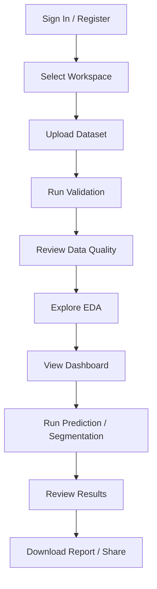
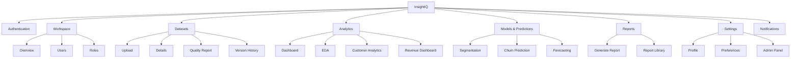
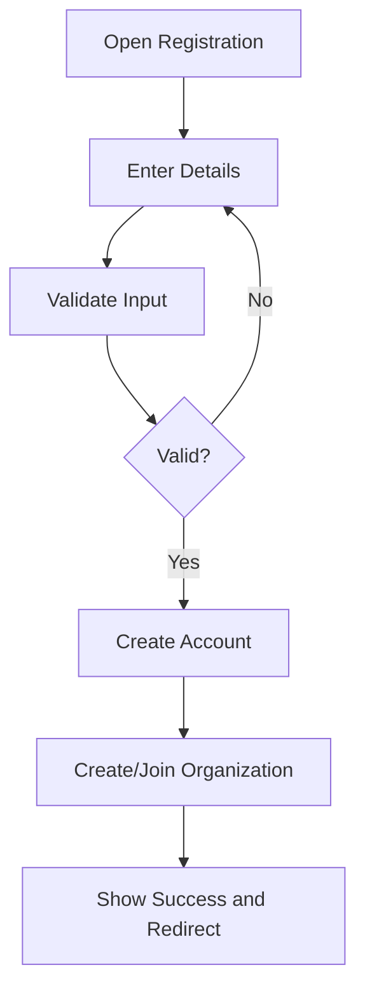
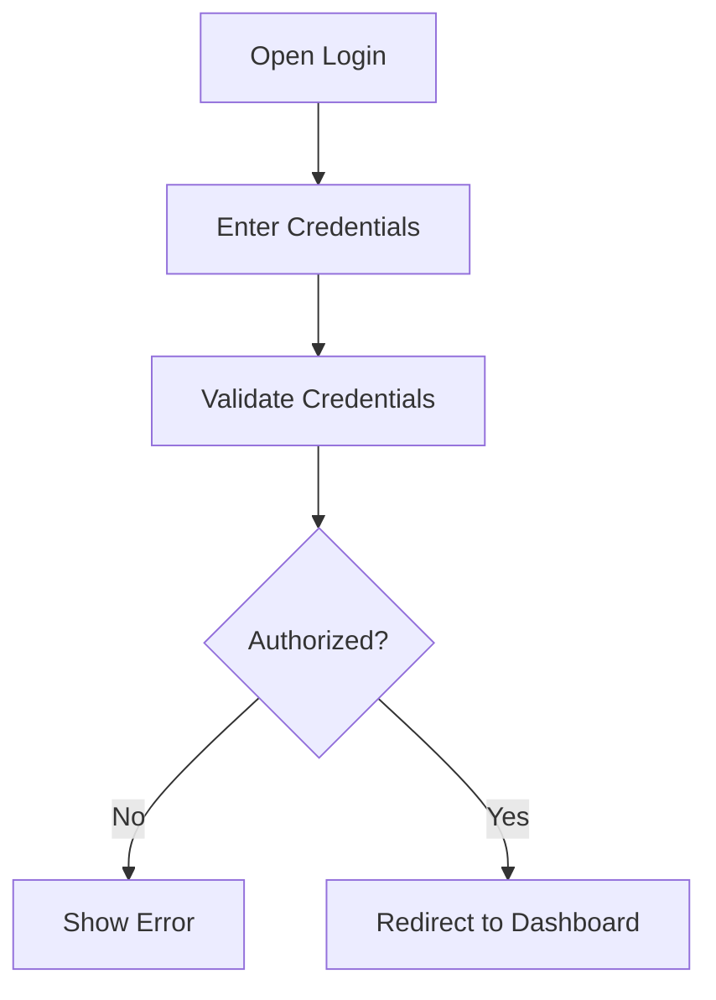
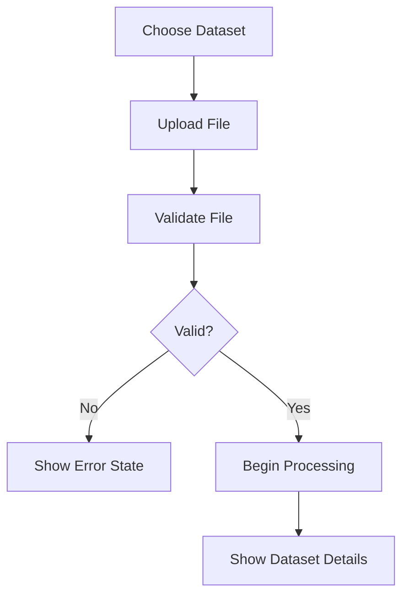
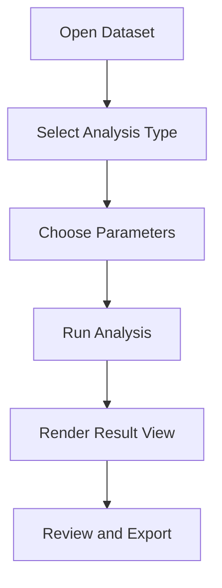
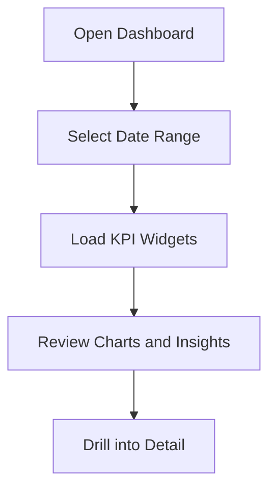
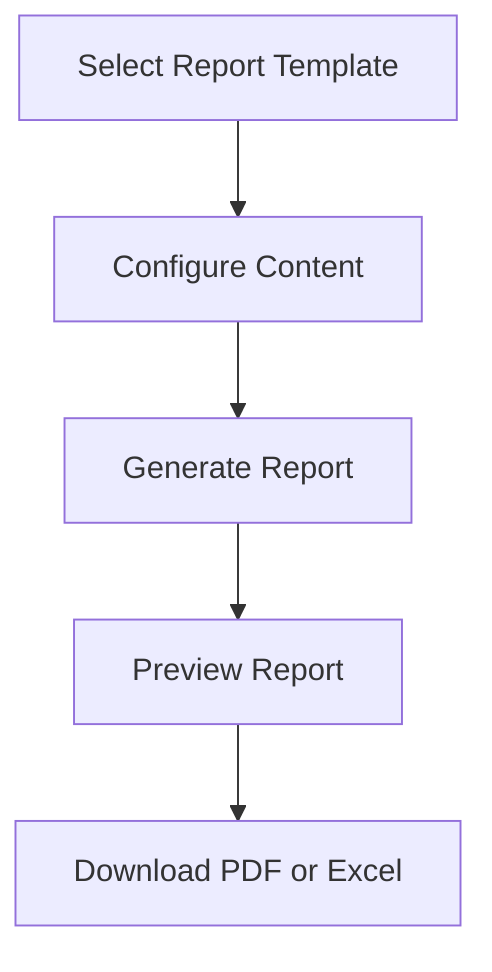
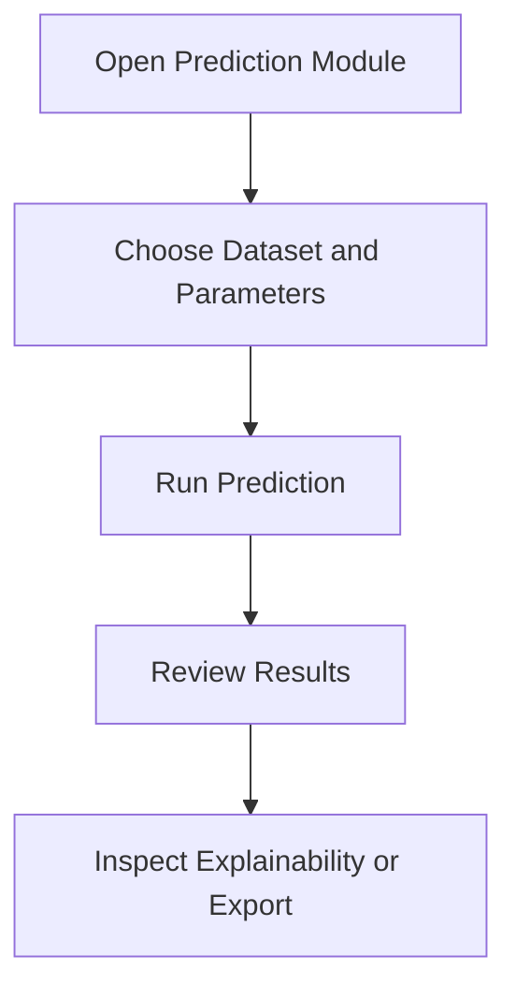

# UI/UX Design Specification

## 1. Design Philosophy

InsightIQ should feel like a premium enterprise analytics workspace: calm, intelligent, and highly operational. The product experience must support high-stakes decision-making while remaining approachable to analysts, scientists, and business stakeholders.

### Core Design Principles

- Minimal: Reduce visual noise and surface only what matters at each moment.
- Easy to Learn: Use familiar SaaS patterns, predictable layouts, and consistent interactions.
- Data-First: Present metrics, relationships, and trends as the primary narrative.
- Accessible: Support keyboard navigation, screen readers, strong contrast, and clear focus states.
- Responsive: Ensure the experience is efficient and usable across desktop, laptop, and tablet.
- Fast: Emphasize speed, lightweight interactions, and progressive loading.
- Intuitive: Guide the user with clear hierarchy, appropriate defaults, and contextual actions.
- Dashboard-Oriented: Make reporting and insight exploration the primary workflow.

### Experience Tone

- Professional and trustworthy
- Confident and modern
- Analytical and calm
- Efficient rather than playful

### Interaction Philosophy

- Default to summary-first views with drill-down capability.
- Keep users in a single “flow” when completing tasks such as upload, analyze, review, and share.
- Make state changes visible, explicit, and recoverable.
- Use progressive disclosure to avoid overwhelming the user.

---

## 2. User Journey

InsightIQ supports a broad range of roles, but the primary experience can be described as a repeatable loop: import data, validate quality, explore insights, act on predictions, and share reports.

### Primary Personas

- Data Analysts: need fast diagnostics, dataset inspection, and dashboard visibility.
- Data Scientists: need model-ready workflows, experiment outputs, and explainability.
- Business Analysts: need KPI visibility, trends, and narrative reporting.
- Marketing Teams: need campaign and customer segment insights.
- Customer Success Teams: need retention, churn, and customer health views.
- Product Managers: need strategic dashboards and executive reporting.

### End-to-End User Journey

1. User signs in or registers.
2. User creates or selects an organization workspace.
3. User uploads a dataset.
4. System runs validation and quality checks.
5. User reviews the data quality report.
6. User explores EDA insights and dashboard metrics.
7. User runs segmentation, churn, or forecasting workflows.
8. User reviews outputs and downloads reports.
9. User shares insights with collaborators or views notifications.

### Journey Narrative

The experience should feel like a guided analytics workspace rather than a generic application. Users should be able to move from raw data to insight with minimal friction and clear feedback at every step.

---

## 3. Information Architecture

The information architecture should prioritize clarity, discoverability, and task-based navigation. The product should feel structured around workspaces, datasets, analytics, and reporting.

### Core Information Groups

- Authentication and account access
- Workspace and organization management
- Dataset lifecycle
- Data quality and validation
- Exploration and analysis
- Prediction and segmentation
- Reporting and exports
- Settings and administration
- Notifications and activity

### IA Structure

### Navigation Hierarchy

- Primary: Dashboard, Datasets, Analytics, Reports, Settings
- Secondary: Upload Dataset, Data Quality, EDA, Segmentation, Churn, Forecasting, Notifications
- Tertiary: Dataset Details, Report Preview, Prediction Results, Profile, Admin

---

## 4. Navigation Structure

### Global Navigation

The application should use a persistent left navigation for primary destinations and a top bar for global actions.

### Left Sidebar

- Dashboard
- Datasets
- Analytics
- Predictions
- Reports
- Settings
- Admin (for privileged users)

### Top Navigation

- Search bar
- Notifications bell
- Workspace switcher
- Help/accessibility shortcuts
- User profile menu

### Secondary Navigation Patterns

- Tabs for related views such as Dataset Details > Overview / Quality / Versions
- Filter chips for dashboard contexts
- Segment-level navigation for analytics modules

### Navigation Behavior

- Active states should be visually distinct and consistent.
- Use breadcrumbs for deeper levels such as Datasets > Dataset Name > Data Quality.
- Preserve context when navigating between datasets and analytics views.

---

## 5. Dashboard Layout

The dashboard is the central entry point and should be optimized for scanning and decision-making.

### Dashboard Layout Structure

- Header area with page title, date range controls, and primary actions
- Summary KPI section at the top
- Main content area with a 12-column grid on desktop
- Left column for primary analytics cards and charts
- Right column for secondary insights, alerts, or recommendations
- Bottom section for recent activity, recent reports, and quick actions

### Recommended Dashboard Modules

- KPI cards for revenue, active customers, churn, retention, forecast accuracy
- Trend chart for revenue and growth
- Recent datasets panel
- Alerts and notifications
- Quick actions for upload, run analysis, generate report

### Layout Rules

- Prioritize the most important metric at top-left or top-center.
- Keep cards aligned and consistent in size where possible.
- Avoid placing more than one primary action per section.
- Maintain ample whitespace around major blocks.

---

## 6. Screen Inventory

| Screen | Purpose | Primary User |
|---|---|---|
| Login | Authenticate returning users | All users |
| Registration | Create an account and create or join a workspace | New users |
| Forgot Password | Recover account access | All users |
| Dashboard | Central overview of metrics and recent activity | All users |
| Dataset Upload | Import a dataset into the platform | Analysts / Scientists |
| Dataset Details | Review dataset metadata, schema, and processing state | Analysts |
| Data Quality Report | Inspect validation metrics and data issues | Analysts |
| EDA Dashboard | Explore distributions, trends, and relationships | Analysts / Scientists |
| Customer Analytics | Review customer growth, segmentation, and behavior | Marketing / CS |
| Revenue Dashboard | Review revenue trends and growth metrics | Business Analysts / PMs |
| Segmentation | Create and review customer segments | Data Scientists / Marketing |
| Churn Prediction | Review churn risk outputs and reports | CS / Data Scientists |
| Forecasting | Review revenue or demand forecasts | PMs / Analysts |
| Reports | Generate, review, and download reports | All users |
| Settings | Manage profile, preferences, and workspace settings | All users |
| Profile | Manage personal account details | All users |
| Admin Panel | Manage users, roles, and system configuration | Admins |
| Notifications | Review alerts and activity | All users |

---

## 7. Page-by-Page Wireframe Descriptions

### 7.1 Login

**Purpose**
- Allow users to securely access their account and workspace.

**Primary User**
- Existing users across all roles.

**Main Components**
- Brand header
- Email and password fields
- Primary login button
- Forgot password link
- Sign-up link
- Optional SSO or enterprise identity option

**Actions**
- Submit credentials
- Recover password
- Navigate to registration

**Navigation**
- No sidebar
- Minimal global navigation
- Redirect to dashboard after success

**Validation**
- Inline validation for required fields
- Clear error messaging for invalid credentials

**Error States**
- Invalid email or password
- Account locked or suspended
- Network or server errors

**Empty States**
- No account-specific empty state; form remains ready for input

**Loading States**
- Spinner on submit button
- Skeleton placeholder for auth card

---

### 7.2 Registration

**Purpose**
- Allow new users to create an account and join or create an organization workspace.

**Primary User**
- New users, administrators, or invited team members.

**Main Components**
- Registration form with full name, email, password, organization name or slug, role selection
- Password strength indicator
- Terms and privacy acceptance checkbox
- Secondary sign-in option

**Actions**
- Create account
- Review terms
- Navigate to login

**Navigation**
- Redirect to login or onboarding after completion

**Validation**
- Email format validation
- Password policy validation
- Unique organization slug validation
- Required field validation

**Error States**
- Duplicate email
- Weak password
- Invalid organization slug
- Server error during onboarding

**Empty States**
- No prefilled values; form remains interactive

**Loading States**
- Submit button loading state
- Progressive onboarding indicator

---

### 7.3 Forgot Password

**Purpose**
- Restore access to an existing account via email verification.

**Primary User**
- Users who have forgotten their password.

**Main Components**
- Email input
- Submit button
- Support/help text
- Back to login link

**Actions**
- Request password reset
- Return to login

**Navigation**
- Simple single-column flow
- Redirect to confirmation state after success

**Validation**
- Email format validation
- Clear success confirmation after submission

**Error States**
- Email not found
- Rate-limit or throttle condition

**Empty States**
- Initial empty form state

**Loading States**
- Spinner while reset email is processing

---

### 7.4 Dashboard

**Purpose**
- Give users a fast, high-level overview of current platform status, business performance, and recent activity.

**Primary User**
- All users, especially managers and analysts.

**Main Components**
- Page header with date range and refresh action
- KPI cards
- Trend chart section
- Recent datasets card
- Notifications / alerts panel
- Quick actions panel
- Recent reports panel

**Actions**
- Change date range
- Open analytics modules
- Upload dataset
- Generate report
- Open notifications

**Navigation**
- Sidebar for main destinations
- Top bar for workspace and profile access

**Validation**
- Date range validation
- Alert if selected data is incomplete

**Error States**
- Missing data for selected date range
- Failed chart load state

**Empty States**
- No metrics yet if no datasets have been uploaded
- Suggest first upload action

**Loading States**
- Skeleton cards and chart placeholders
- Progressive loading for each widget

---

### 7.5 Dataset Upload

**Purpose**
- Enable users to import datasets into the platform for validation and analysis.

**Primary User**
- Analysts, scientists, and administrators.

**Main Components**
- Drag-and-drop file upload area
- File type descriptions
- Metadata form fields such as dataset name and description
- Upload progress bar
- Validation warnings summary

**Actions**
- Upload file
- Review file requirements
- Cancel upload
- Continue to dataset details

**Navigation**
- Sidebar access from Datasets section
- Return to dataset library after upload

**Validation**
- File format validation
- File size validation
- Required metadata validation

**Error States**
- Unsupported file type
- File too large
- Upload failure

**Empty States**
- Initial empty drop zone with guidance

**Loading States**
- Upload progress indicator
- Processing indicator after file acceptance

---

### 7.6 Dataset Details

**Purpose**
- Provide comprehensive metadata and lifecycle information for a selected dataset.

**Primary User**
- Analysts and data engineers.

**Main Components**
- Dataset overview header
- Metadata summary
- Schema preview
- Upload timestamp and owner info
- Related actions such as validate, analyze, download
- Tabs for Overview, Schema, Versions, Activity

**Actions**
- Validate dataset
- Open data quality report
- Download dataset
- View versions

**Navigation**
- Breadcrumbs from Datasets to selected dataset
- Tabs for related views

**Validation**
- Show schema warnings or missing field issues
- Validate permissions before access

**Error States**
- Dataset missing or inaccessible
- Processing failed message

**Empty States**
- No schema preview available if dataset is still processing

**Loading States**
- Skeleton for content panels
- Spinner for processing status updates

---

### 7.7 Data Quality Report

**Purpose**
- Show validation status, completeness, anomalies, and data quality health.

**Primary User**
- Analysts and data stewards.

**Main Components**
- Quality score summary
- Metric cards for missing values, duplicates, outliers, invalid types
- Detailed table of issues
- Trend chart of quality over time
- Action buttons for re-run validation or export report

**Actions**
- Re-run validation
- Filter by issue type
- View issue details
- Export report

**Navigation**
- Linked from dataset details and analytics workflows

**Validation**
- Highlight critical issues and severity levels
- Show warning counts by category

**Error States**
- Report could not be generated
- Validation process failed

**Empty States**
- “No quality issues detected” state with success illustration

**Loading States**
- Loading bars and skeleton metric cards

---

### 7.8 EDA Dashboard

**Purpose**
- Help users explore distributions, relationships, and data patterns.

**Primary User**
- Analysts and data scientists.

**Main Components**
- Chart selection toolbar
- Distribution charts
- Correlation matrix or scatter plots
- Summary statistics panel
- Filters for columns and segments
- Data sample table

**Actions**
- Choose chart type
- Apply filters
- Switch variables
- Save exploration view

**Navigation**
- Accessible from Dataset Details or Analytics menu

**Validation**
- Prevent invalid column selection
- Show unsupported chart combinations carefully

**Error States**
- Chart generation failure
- Invalid selected column combination

**Empty States**
- No chart data available until analysis is run

**Loading States**
- Skeleton for chart cards and stat panels

---

### 7.9 Customer Analytics

**Purpose**
- Present customer growth, behavior, and health metrics suitable for marketing and CS teams.

**Primary User**
- Marketing teams, customer success leaders, analysts.

**Main Components**
- KPI cards for active customers, growth rate, retention, LTV proxy
- Trend chart for customer growth over time
- Segment breakdown table
- Behavioral metric cards
- Filters for region, segment, cohort

**Actions**
- Filter by segment
- Compare cohorts
- Export insights

**Navigation**
- Linked from main analytics navigation

**Validation**
- Warn if selected filters result in very small sample size

**Error States**
- Insufficient data to render current view
- Failed query state

**Empty States**
- No customer data yet for the selected period

**Loading States**
- Skeleton panels with placeholder chart content

---

### 7.10 Revenue Dashboard

**Purpose**
- Surface revenue performance and trends in a clear, decision-oriented layout.

**Primary User**
- Business analysts, finance-oriented users, product managers.

**Main Components**
- Revenue trend chart
- Top-performing products or segments
- KPI cards for MRR, recurring revenue, growth, forecast delta
- Period comparison chart

**Actions**
- Change time range
- Compare periods
- View underlying detail

**Navigation**
- From Analytics or Dashboard

**Validation**
- Ensure date range and currency scope are consistent

**Error States**
- Missing revenue data
- Unexpected aggregation issue

**Empty States**
- “No revenue data available for selected period”

**Loading States**
- Progressive chart loading

---

### 7.11 Segmentation

**Purpose**
- Create and inspect customer segments based on behavioral or demographic attributes.

**Primary User**
- Data scientists, marketing analysts.

**Main Components**
- Segment configuration form
- Feature selection controls
- Result table of segments with sizes and descriptions
- Visual summary of segment distribution

**Actions**
- Create segmentation run
- Edit parameters
- View segment details

**Navigation**
- From Predictions section or analytics entry point

**Validation**
- Require a valid dataset and feature selection
- Prevent impossible segment counts

**Error States**
- Insufficient input data
- Model runs failed

**Empty States**
- No segments yet; encourage user to run a segmentation workflow

**Loading States**
- Spinner and progress indicator for model run

---

### 7.12 Churn Prediction

**Purpose**
- Surface churn risk insights and recommended follow-up actions.

**Primary User**
- Customer success managers, analysts, data scientists.

**Main Components**
- Prediction run controls
- Risk summary metrics
- Churn risk distribution chart
- Table of at-risk customers
- Explanation panel or highlights

**Actions**
- Run prediction
- Filter high-risk users
- Review reasons and actions

**Navigation**
- Under Predictions or analytics module

**Validation**
- Ensure the selected dataset and target column are valid

**Error States**
- Missing target data
- Prediction model unavailable

**Empty States**
- “No predictions generated yet” guidance state

**Loading States**
- Progress indicator for prediction execution

---

### 7.13 Forecasting

**Purpose**
- Display future projections for sales, usage, or revenue.

**Primary User**
- Product managers, business analysts, forecasting stakeholders.

**Main Components**
- Forecast configuration panel
- Forecast chart with confidence bands
- Summary metrics and horizon settings
- Comparison with historical values

**Actions**
- Adjust forecast horizon
- Run forecasting workflow
- Compare scenarios

**Navigation**
- Under Predictions or analytics menu

**Validation**
- Validate forecast horizon and selected variable

**Error States**
- Model generation failure
- Insufficient historical data

**Empty States**
- No forecast available; prompt to run a forecast

**Loading States**
- Skeleton chart and process indicators

---

### 7.14 Reports

**Purpose**
- Allow users to generate and review export-ready reports.

**Primary User**
- Analysts, managers, and executives.

**Main Components**
- Report builder or template picker
- Preview pane
- Export options for PDF and Excel
- Report history list

**Actions**
- Create report
- Preview report
- Download report
- Share report

**Navigation**
- Primary reports section with list and detail views

**Validation**
- Ensure required sections and date range are selected

**Error States**
- Report generation failure
- Invalid configuration

**Empty States**
- No reports generated yet

**Loading States**
- Progress state during report generation

---

### 7.15 Settings

**Purpose**
- Let users manage preferences, notifications, and organization-level configurations.

**Primary User**
- All users, especially admins and power users.

**Main Components**
- Settings categories (profile, preferences, billing, organization)
- Toggle controls, dropdowns, form fields
- Save action

**Actions**
- Update settings
- Save changes
- Reset to defaults

**Navigation**
- Global settings entry from profile or sidebar

**Validation**
- Validate updated fields before save

**Error States**
- Save failure or permission-related error

**Empty States**
- Not relevant; settings forms are always present

**Loading States**
- Save spinner and optimistic update cues

---

### 7.16 Profile

**Purpose**
- Let users view and update their personal account information.

**Primary User**
- All authenticated users.

**Main Components**
- Profile avatar and summary
- Personal details form
- Security settings section
- Preferences summary

**Actions**
- Edit personal information
- Update password
- Upload avatar

**Navigation**
- From top-right profile menu

**Validation**
- Email and password validation
- Required field validation

**Error States**
- Update failure or duplicate email conflict

**Empty States**
- Not relevant except for avatar absence

**Loading States**
- Skeleton for profile content and save state

---

### 7.17 Admin Panel

**Purpose**
- Support governance, access management, and platform oversight.

**Primary User**
- Admins and platform operators.

**Main Components**
- User management table
- Role management controls
- Organization settings
- Audit log and activity views
- Feature flags or configuration panels

**Actions**
- Add user
- Assign role
- Suspend account
- View audit activities

**Navigation**
- Restricted access area in sidebar or secondary navigation

**Validation**
- Permission checks and form validation

**Error States**
- Unauthorized access
- Failed role change or deletion

**Empty States**
- No users or audit entries found

**Loading States**
- Skeleton tables and panel loaders

---

### 7.18 Notifications

**Purpose**
- Surface recent alerts, completed tasks, and system updates.

**Primary User**
- All users.

**Main Components**
- Notification list
- Filter by unread/all
- Mark as read action
- Notification detail panel or modal

**Actions**
- Mark as read
- Open related item
- Dismiss or archive

**Navigation**
- Accessible from top navigation and global action area

**Validation**
- Ensure relevant actions are available only for actionable items

**Error States**
- Failed notification refresh

**Empty States**
- “No notifications yet” state

**Loading States**
- Lightweight loading skeleton for list items

---

## 8. Component Library

### Buttons

- Primary button for main actions such as Save, Upload, Run Analysis
- Secondary button for less critical actions such as Cancel or Back
- Tertiary or text button for low-priority actions
- Button states should include default, hover, focus, disabled, loading, and success

### Cards

- Use cards for KPI summaries, dataset summaries, recent activity, and analytics panels
- Keep consistent spacing and padding
- Use subtle elevation and strong internal hierarchy

### Tables

- Use tables for datasets, users, audit logs, report history, and segment results
- Support row hover, sorting, and selection states
- Prefer sticky headers on dense tables

### Charts

- Use chart cards with clear legends, axis labels, and concise titles
- Provide accessible alternatives such as summaries or tabular views
- Avoid overloading a single page with too many charts

### Forms

- Use stacked form layouts for create/edit flows
- Group related inputs into sections
- Show inline validation and error summaries where appropriate

### Dialogs

- Use dialogs for destructive actions, confirmations, and focused configuration tasks
- Keep dialogs short and action-oriented

### Toasts

- Use toasts for short success or failure feedback such as report export completed or upload failed
- Avoid long-form multi-paragraph toasts

### Badges

- Use badges for statuses such as Active, Processing, Warning, Failed, or Draft

### Progress Indicators

- Use progress bars for uploads and background tasks
- Use stepper-style progress for multi-step processes when needed

### Tabs

- Use tabs for related views such as Overview, Quality, Versions, Activity

### Sidebar

- Persistent vertical navigation for core application areas
- Indicate active state clearly

### Top Navigation

- Contain global commands and identity controls
- Keep it compact and predictable

### Search

- Provide search in the global header and key list views
- Show recent or saved searches where helpful

### Filters

- Use filter chips and dropdown controls for date ranges, segments, and dataset attributes

### Pagination

- Use pagination for large lists and tables
- Provide page size controls where necessary

---

## 9. Design System

### Typography

- Primary typeface: Inter, Manrope, or a clean sans-serif similar to modern analytics products
- Heading scale:
  - H1: 32px / 700
  - H2: 24px / 600
  - H3: 20px / 600
  - H4: 16px / 600
  - Body: 14px / 400
  - Small: 12px / 400
- Maintain strong typographic hierarchy and avoid excessive font weight variation

### Spacing

- Use an 8px spacing system
- Common spacing values: 8, 12, 16, 24, 32, 40, 48
- Maintain consistent padding inside cards and page sections

### Grid System

- Use a 12-column layout on desktop and laptop screens
- Use 8-column or 4-column layouts on tablets where needed
- Align content blocks to a consistent vertical rhythm

### Border Radius

- Small: 6px
- Medium: 10px
- Large: 16px
- Use rounded corners for cards, buttons, and chart containers

### Iconography

- Use a modern outline icon set for navigation and actions
- Reserve filled icons for emphasis or alerts only
- Icons should be simple, consistent, and clear in meaning

### Accessibility

- Minimum target size for interactive controls: 44x44px
- Maintain visible focus states on all controls
- Avoid placing critical actions in low-contrast or ambiguous states

### Responsive Breakpoints

- Mobile: under 768px
- Tablet: 768px to 1023px
- Laptop: 1024px to 1439px
- Desktop: 1440px and above

---

## 10. Color Palette

The palette should feel professional, trustworthy, and modern while supporting analytics clarity and accessibility.

| Role | Color | Usage |
|---|---|---|
| Primary | #2563EB | Primary buttons, active nav, link states |
| Secondary | #7C3AED | Secondary emphasis, supporting actions |
| Success | #16A34A | Positive states, healthy metrics |
| Warning | #F59E0B | Warnings, pending states, caution |
| Danger | #DC2626 | Errors, destructive actions |
| Neutral | #64748B | Secondary text, muted states |
| Background | #F8FAFC | App background |
| Surface | #FFFFFF | Cards, panels, forms |
| Border | #E2E8F0 | Dividers and input borders |
| Text Primary | #0F172A | Main text |
| Text Secondary | #475569 | Muted supporting text |

### Color Guidance

- Use the primary blue as the dominant brand color for navigation and call-to-action states.
- Use neutral surfaces heavily to keep an analytic, airy aesthetic.
- Use green, amber, and red conservatively and consistently for status and severity.
- Ensure contrast ratios meet WCAG AA requirements.

---

## 11. Charts and Visualization Recommendations

The platform should favor clarity over visual ornamentation. Each chart should have a purpose and support rapid interpretation.

| Metric / Use Case | Recommended Visualization | Rationale |
|---|---|---|
| Revenue Trends | Line chart | Best for showing change over time |
| Customer Growth | Area chart or line chart | Useful for cumulative growth trends |
| Churn Rate | Line chart with trend markers | Clear for longitudinal monitoring |
| Segmentation | Bar chart or stacked bar chart | Easy to compare segment sizes and composition |
| Feature Importance | Horizontal bar chart | Good for ranking variables clearly |
| Correlation | Heatmap | Efficient for dense multivariate relationships |
| Retention | Cohort chart or line chart | Strong for retention over time |
| Forecasting | Line chart with forecast band | Best for showing future projection and uncertainty |
| KPIs | KPI cards with sparklines | Best for high-level values and instant scanning |

### Visualization Principles

- Always label axes and series clearly.
- Provide legends only when necessary.
- Use consistent color coding by metric or status.
- Allow users to toggle between chart and table views where appropriate.

---

## 12. UX Flows

### 12.1 User Registration Flow

### 12.2 Login Flow

### 12.3 Upload Dataset Flow

### 12.4 Run Analytics Flow

### 12.5 View Dashboard Flow

### 12.6 Download Report Flow

### 12.7 Run Prediction Flow

---

## 13. Responsive Design

### Desktop

- Full-width sidebar and multi-panel layout
- Best suited for analysts and administrators handling large datasets and multiple views
- Use a wide grid for dashboards and comparison views

### Laptop

- Keep the same information hierarchy but reduce visual density slightly
- Use collapsible secondary panels where appropriate
- Prioritize summary cards and primary charts in the main content area

### Tablet

- Convert to a condensed layout with a collapsible sidebar or top nav drawer
- Stack panels vertically where horizontal space is limited
- Preserve critical tasks such as upload, dashboard review, and reporting

### Responsive Interaction Principles

- Ensure primary actions remain visible without requiring excessive scrolling
- Allow chart and table views to resize gracefully
- Prioritize content based on screen width and user context

---

## 14. Accessibility

The platform should meet WCAG 2.1 AA expectations and be usable by a wide range of users, including those using assistive technologies.

### Accessibility Requirements

- Provide sufficient color contrast for text and interactive elements
- Support keyboard-only navigation across all major flows
- Ensure form fields have clear labels and visible error text
- Use semantic headings and landmarks
- Provide screen-reader-friendly chart summaries or alternative data tables
- Avoid motion-heavy transitions or provide reduced-motion support
- Ensure focus states are visible and not obscured
- Make all dialog content reachable and dismissible via keyboard

### Accessibility Patterns

- Use descriptive link and button labels
- Avoid relying on color alone for status indication
- Provide accessible names for icons that perform actions
- Ensure responsive layouts do not cause clipping or content overlap

---

## 15. Implementation Guidance for Frontend Development

The following product decisions should guide implementation without constraining the visual style unnecessarily.

- Maintain a consistent shell across the application: sidebar + top bar + content area
- Keep page headers predictable: title, context, actions, and filters
- Treat dashboards as modular and composable
- Use progressive disclosure for advanced analytic controls
- Provide always-visible entry points for the most common actions: upload, analyze, report
- Ensure state-driven feedback is consistent across the application

---

## 16. Summary

InsightIQ should be experienced as a polished, enterprise-grade analytics workspace that helps users move from raw data to decision-ready insight with efficiency and confidence. The UI/UX should emphasize clarity, actionability, and structure while remaining approachable for diverse roles across the organization.
