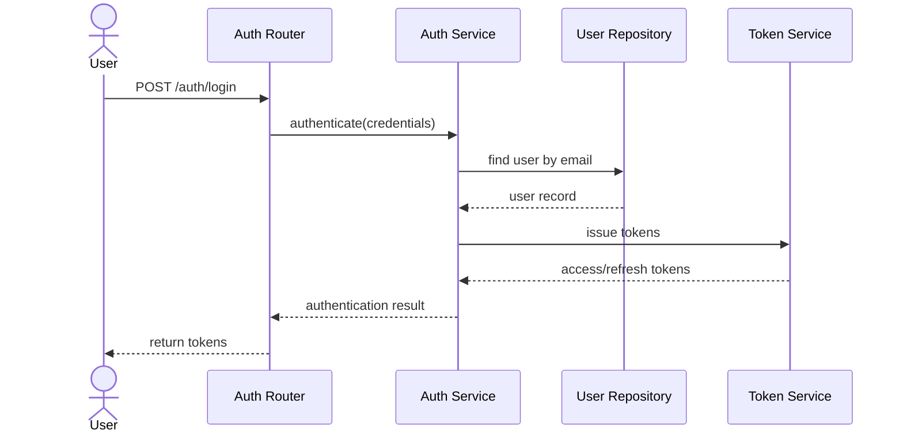
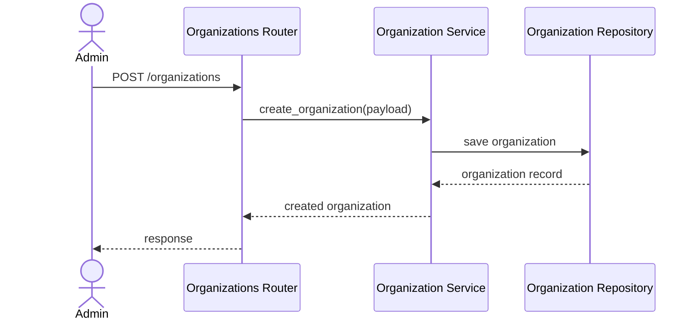
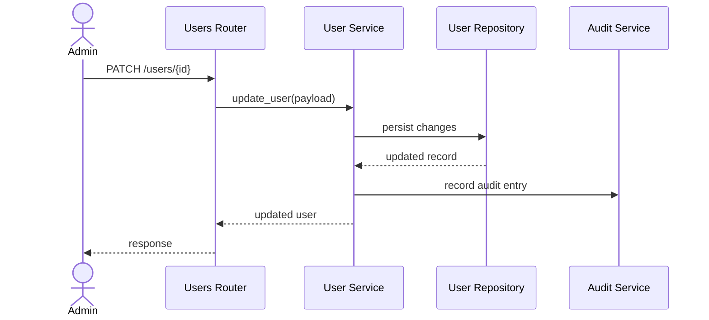
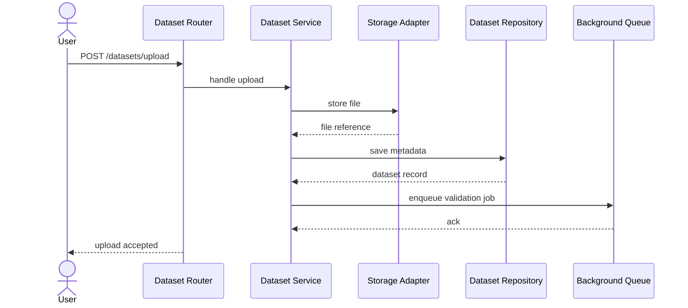
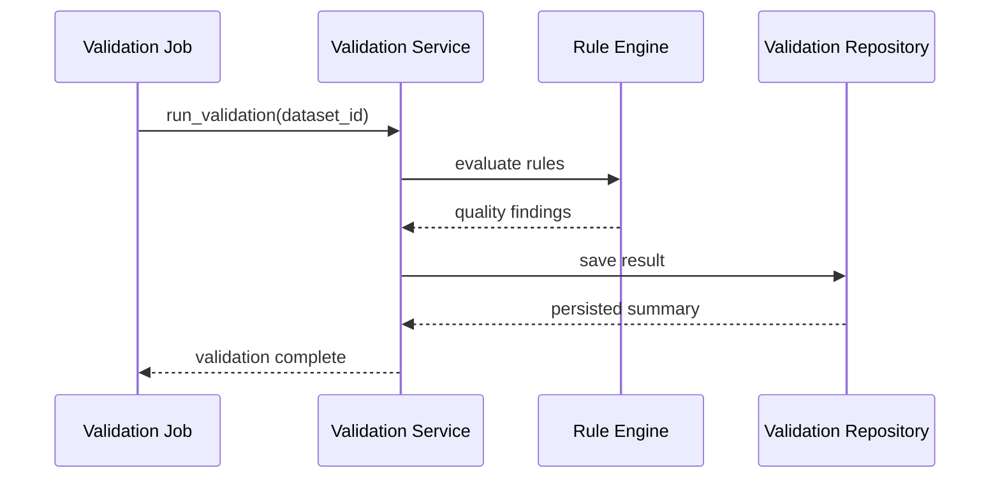
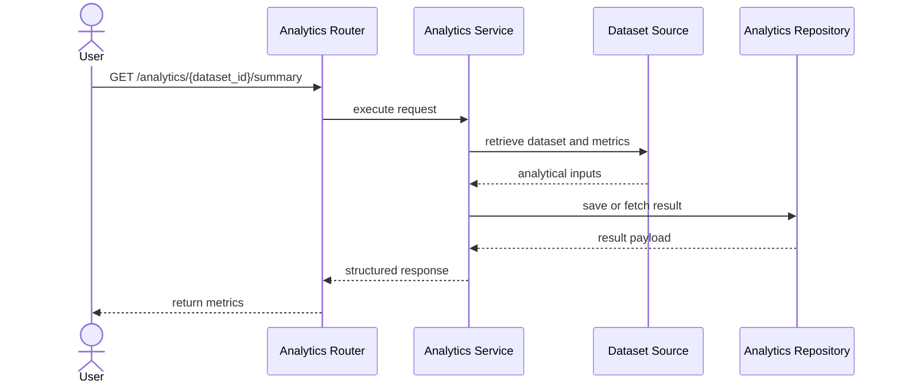
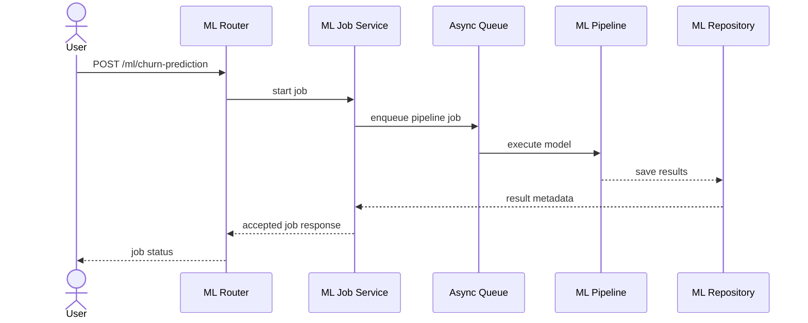
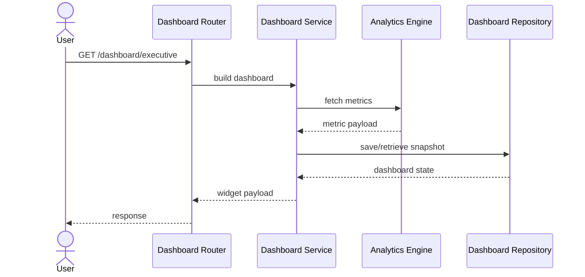
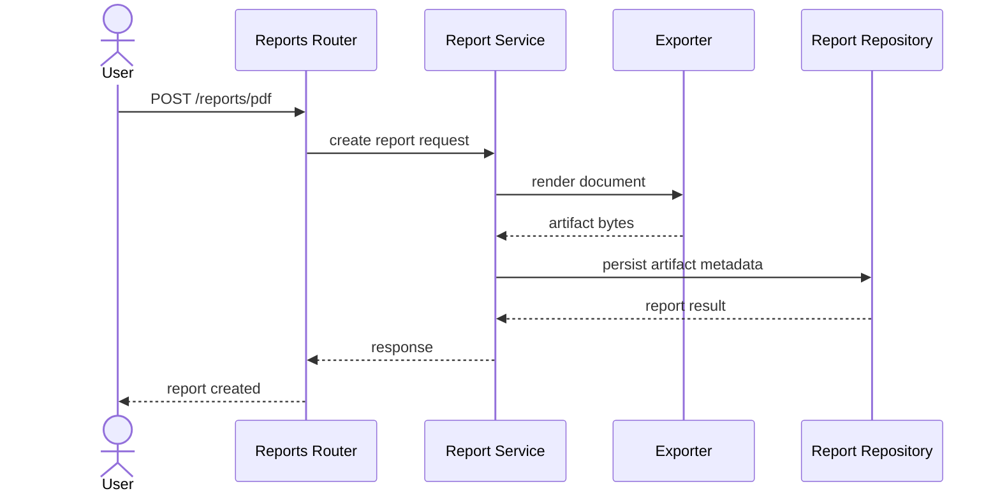
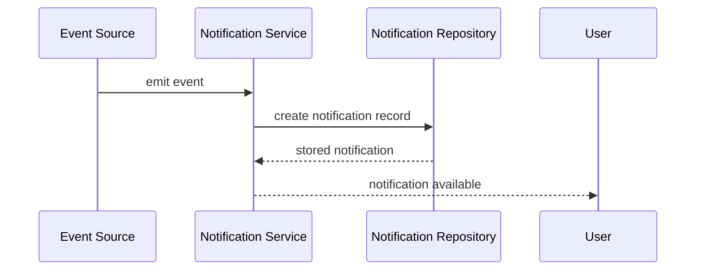

# Technical Design Document

## 1. Overview

This document translates the high-level architecture of InsightIQ into a practical engineering design for implementation. It describes the core modules, responsibilities, data flow, interactions, validation rules, security controls, logging expectations, and extension points for the platform.

The design assumes a modular, service-oriented implementation using a React + TypeScript frontend and a Python + FastAPI backend, with PostgreSQL as the primary store, and ML workflows executed as asynchronous tasks.

---

## 2. System Context

InsightIQ is an enterprise SaaS platform that supports:

- Secure authentication and role-based access
- Organization and user management
- Dataset ingestion and processing
- Data quality validation
- Analytics and dashboard preparation
- Machine learning workflows including segmentation and forecasting
- Reporting and notifications

The design is structured around clear application boundaries so each domain module can evolve independently while remaining integrated through common services and shared contracts.

---

## 3. Architectural Principles

- Separation of concerns across domains and layers
- Clear service boundaries for business logic
- Dependency inversion for external integrations
- Async processing for long-running jobs
- Observability and auditability by default
- Strong validation and security at every boundary
- Extensibility for new analytics and ML capabilities

---

## 4. Overall Architecture

### High-Level Layers

- Presentation Layer: React + TypeScript web application
- API Layer: FastAPI routers and request handlers
- Application Layer: services and orchestration logic
- Domain Layer: entities, business rules, validation logic
- Infrastructure Layer: repositories, persistence, task queues, external integrations

### Runtime Model

- Read-heavy and interactive operations handled synchronously through REST APIs
- Long-running jobs such as dataset validation, analytics generation, and ML execution handled asynchronously
- Event-driven notifications and status updates communicated through a background job system and notification service

---

## 5. Authentication Module

### Purpose

Provide secure identity management and access control for users and organizations.

### Responsibilities

- Register users
- Authenticate users
- Issue and validate access and refresh tokens
- Enforce role-based access control
- Support password reset and email verification
- Manage session lifecycle and token revocation

### Folder Structure

```text
/backend/app/auth/
  __init__.py
  router.py
  service.py
  schemas.py
  dependencies.py
  utils.py
  tokens.py
  exceptions.py
```

### Classes

- AuthService
- TokenService
- PasswordService
- SessionManager
- RolePolicy

### Interfaces

- AuthProvider
- TokenIssuer
- PasswordHasher

### Services

- RegistrationService
- LoginService
- PasswordResetService
- TokenRefreshService
- PermissionService

### Repositories

- UserRepository
- RefreshTokenRepository
- PasswordResetTokenRepository

### Data Flow

1. User submits credentials to authentication endpoint.
2. AuthService validates credentials and role context.
3. TokenService issues access and refresh tokens.
4. Client stores and presents tokens on subsequent requests.
5. Middleware validates tokens and attaches identity context.

### Sequence Diagram



### Validation Rules

- Email must be valid and unique
- Password must meet complexity policy
- Login requires active and verified account
- Token expiration and audience claims must be validated

### Error Handling

- Return 401 for invalid credentials
- Return 403 for insufficient permissions
- Return 409 for duplicate account registrations
- Log authentication failures with request correlation metadata

### Logging Strategy

- Log successful authentication events at INFO
- Log failed attempts and token validation failures at WARNING or ERROR
- Include request ID and user ID where available

### Security Considerations

- Hash passwords using a strong password hashing algorithm
- Use short-lived access tokens and refresh token rotation
- Enforce HTTPS in production
- Restrict token exposure to secure storage and secure transport

### Dependencies

- User repository
- Token configuration
- Email service for verification and reset flows

### Extension Points

- Add SSO integration
- Add multi-factor authentication
- Add enterprise identity provider connectors

---

## 6. Organizations Module

### Purpose

Manage tenant-level organization resources and their relationship to users, datasets, and settings.

### Responsibilities

- Create and update organizations
- Assign organization administrators and members
- Enforce organization-level scoping for other resources
- Manage organization settings and billing-related metadata where applicable

### Folder Structure

```text
/backend/app/organizations/
  __init__.py
  router.py
  service.py
  schemas.py
  repository.py
  models.py
```

### Classes

- OrganizationService
- OrganizationSettingsService
- OrganizationPolicy

### Interfaces

- OrganizationStore

### Services

- OrganizationCreationService
- OrganizationMemberService
- OrganizationSettingsService

### Repositories

- OrganizationRepository
- OrganizationMemberRepository

### Data Flow

1. Admin creates an organization through the API.
2. Service validates uniqueness of slug and required fields.
3. Repository persists organization and initial membership record.
4. Organization context is attached to subsequent resource operations.

### Sequence Diagram



### Validation Rules

- Name and slug are required
- Slug must be unique and conform to allowed format
- Only authorized users can manage organization records

### Error Handling

- Return 409 for duplicate organization slug
- Return 403 for unauthorized organization administration
- Return 404 when organization is missing

### Logging Strategy

- Log creation, updates, and member modifications at INFO
- log privilege changes and access violations at WARNING or ERROR

### Security Considerations

- Enforce tenant isolation at API and data access layers
- Prevent cross-organization data leakage through scoped queries

### Dependencies

- Authentication services
- User repository
- Settings repository

### Extension Points

- Support multi-tenant feature flags
- Add subscription and billing integration hooks

---

## 7. Users Module

### Purpose

Manage user profiles, role assignment, account status, and user-level preferences within an organization.

### Responsibilities

- Create and edit user profiles
- Manage user roles and statuses
- Support self-service profile updates
- Enforce organization and role visibility constraints

### Folder Structure

```text
/backend/app/users/
  __init__.py
  router.py
  service.py
  schemas.py
  repository.py
  policy.py
```

### Classes

- UserService
- UserProfileService
- RoleAssignmentService

### Interfaces

- UserDirectory

### Services

- ProfileUpdateService
- RoleAssignmentService
- UserStatusService

### Repositories

- UserRepository
- RoleRepository
- UserOrganizationRepository

### Data Flow

1. User or admin submits profile or role change request.
2. Service validates the request against organization and role policies.
3. Repository updates the user record and related associations.
4. Audit events are generated for governance and traceability.

### Sequence Diagram



### Validation Rules

- Only valid role assignments are allowed
- User status transitions must follow allowed state flow
- Profile updates must satisfy shape and field constraints

### Error Handling

- Return 404 for missing user
- Return 403 for unauthorized modifications
- Return 409 for invalid role or duplicate assignment conflicts

### Logging Strategy

- Log profile changes and role updates at INFO
- Log suspicious role escalation or unauthorized access at ERROR

### Security Considerations

- Prevent privilege escalation through role assignment logic
- Ensure access control checks happen before data exposure

### Dependencies

- Authentication service
- Organization service
- Audit service

### Extension Points

- Add SSO-linked profile synchronization
- Add support for multiple organization membership contexts

---

## 8. Dataset Upload Module

### Purpose

Allow users to upload files containing structured business data and create normalized dataset records in the platform.

### Responsibilities

- Receive and store uploaded files
- Create dataset metadata records
- Validate file types and size limits
- Track upload state and processing status
- Trigger downstream validation and analytics workflows

### Folder Structure

```text
/backend/app/datasets/
  __init__.py
  router.py
  service.py
  schemas.py
  repository.py
  storage.py
  tasks.py
```

### Classes

- DatasetService
- DatasetStorageService
- UploadProcessor
- DatasetStatusManager

### Interfaces

- StorageAdapter
- DatasetFileHandler

### Services

- UploadService
- MetadataService
- DatasetLifecycleService

### Repositories

- DatasetRepository
- DatasetVersionRepository

### Data Flow

1. User uploads a file through the API.
2. Service validates file type and size.
3. File is stored in configured storage backing.
4. Dataset metadata and status are written to the database.
5. Background processing is triggered for validation and analysis preparation.

### Sequence Diagram



### Validation Rules

- File type must be supported
- File size must be within configured maximum
- Dataset name and owner context must be present
- Duplicate uploads may be allowed only if versioning rules permit it

### Error Handling

- Return 413 for oversized files
- Return 400 for invalid file format
- Return 500 for storage access failures
- Mark dataset status as failed on processing exceptions

### Logging Strategy

- Log upload start, completion, and failures at INFO and ERROR
- Log storage path and file metadata with sensitivity controls

### Security Considerations

- Restrict file access to authorized users and organization context
- Scan and sanitize file-related metadata where practical
- Store uploaded files in a secure and isolated location

### Dependencies

- Storage backend
- Database for metadata
- Queue system for asynchronous jobs

### Extension Points

- Add support for other file formats
- Support chunked or resumable upload workflows
- Integrate virus scanning or content policy checks

---

## 9. Data Validation Module

### Purpose

Assess dataset integrity, quality, and consistency before analytics and ML workflows are executed.

### Responsibilities

- Run structural validation on uploaded datasets
- Detect missing values, duplicates, invalid types, and anomalies
- Produce validation summaries and issue lists
- Persist validation reports and metrics
- Surface validation status to the user

### Folder Structure

```text
/backend/app/validation/
  __init__.py
  router.py
  service.py
  rules.py
  schemas.py
  repository.py
  tasks.py
```

### Classes

- ValidationService
- RuleEngine
- ValidationIssue
- QualityScoreCalculator

### Interfaces

- ValidationRule

### Services

- SchemaValidationService
- CompletenessValidationService
- DuplicatesValidationService
- TypeValidationService

### Repositories

- ValidationResultRepository
- ValidationIssueRepository

### Data Flow

1. Validation job is triggered for a dataset.
2. Validation rules inspect rows and columns.
3. Findings are aggregated into a quality score and issue list.
4. Results are stored for downstream consumption.
5. User can review results and decide whether to proceed.

### Sequence Diagram



### Validation Rules

- Required columns must be present where specified
- Non-empty values must satisfy configured rules
- Unsupported or malformed values must be flagged
- Duplicates and outliers should be counted and reported

### Error Handling

- Return clear validation summaries even when some checks fail
- Consider partial validation results for recoverable errors
- Flag system-level failures separately from data-quality issues

### Logging Strategy

- Log validation job start, completion, and failures
- Log counts and severity distribution for each rule execution

### Security Considerations

- Avoid exposing raw sensitive values in error messages
- Enforce authorization before exposing validation outputs

### Dependencies

- Dataset repository
- Storage adapter
- Analytics metadata service

### Extension Points

- Add custom validation rules per organization
- Add rule templates for industry-specific data quality checks

---

## 10. Analytics Engine Module

### Purpose

Generate analytics views for datasets, including summary statistics, trends, and business-focused metrics.

### Responsibilities

- Prepare summary statistics and descriptive analytics
- Compute KPI-style metrics and trend values
- Support customer, revenue, and retention analysis views
- Return analysis outputs in a structured format for dashboards and reports

### Folder Structure

```text
/backend/app/analytics/
  __init__.py
  router.py
  service.py
  schemas.py
  calculators.py
  repository.py
  tasks.py
```

### Classes

- AnalyticsService
- SummaryCalculator
- RevenueAnalyticsService
- CustomerAnalyticsService
- RetentionAnalyticsService

### Interfaces

- MetricProvider

### Services

- KPIService
- TrendAnalysisService
- CohortAnalysisService

### Repositories

- AnalyticsResultRepository
- MetricDefinitionRepository

### Data Flow

1. User requests an analytics view for a dataset or organization.
2. Service gathers required parameters and input context.
3. Analytics calculations are executed over validated data.
4. Results are persisted or returned in a structured response.
5. Dashboard and report modules consume these outputs.

### Sequence Diagram



### Validation Rules

- Requested dataset and metrics must be valid
- Date ranges must be well-formed
- Unsupported metric groupings must be rejected

### Error Handling

- Return 404 for missing datasets or analysis results
- Return 422 for unsupported parameters
- Return 500 for analysis execution failure with safe messaging

### Logging Strategy

- Log analysis start, completion, and partial failures
- Track metric generation counts and processing duration

### Security Considerations

- Ensure organization-level access control on analytics data
- Avoid returning sensitive data beyond authorized scopes

### Dependencies

- Dataset repository
- Validation results
- Dashboard engine services

### Extension Points

- Add new analytics modules for domain-specific metrics
- Support custom calculated fields

---

## 11. Machine Learning Pipeline Module

### Purpose

Support ML-driven workflows such as segmentation, churn prediction, forecasting, and explainability.

### Responsibilities

- Prepare ML training or inference inputs
- Execute pipelines for segmentation and predictive models
- Store job state, results, and metadata
- Provide explainability and feature importance outputs where relevant

### Folder Structure

```text
/backend/app/ml/
  __init__.py
  router.py
  service.py
  pipelines.py
  models.py
  schemas.py
  repository.py
  tasks.py
  explainability.py
```

### Classes

- MLJobService
- SegmentationPipeline
- ChurnPredictionPipeline
- ForecastingPipeline
- ExplainabilityService

### Interfaces

- ModelRunner
- ModelArtifactStore

### Services

- TrainingService
- InferenceService
- EvaluationService

### Repositories

- MLJobRepository
- ModelResultRepository

### Data Flow

1. User requests an ML workflow for a selected dataset and parameters.
2. Service validates input and prepares model inputs.
3. Background processing executes the selected pipeline.
4. Results are stored with status and metadata.
5. Consumers view results or export them to reports.

### Sequence Diagram



### Validation Rules

- Dataset must be present and valid for the selected model
- Feature columns must be supported
- Horizon and segment count must be positive and within allowed ranges
- Model input quality must be sufficient for execution

### Error Handling

- Return 202 for accepted asynchronous jobs
- Return 400 or 422 for invalid parameters
- Return 500 for job execution failures with structured error metadata
- Persist job status as failed when exceptions occur

### Logging Strategy

- Log job creation, execution progress, completion, and failure
- Capture model configuration and runtime metrics in structured logs
- Avoid storing sensitive feature values unless necessary and secure

### Security Considerations

- Restrict ML execution to authorized users and organizations
- Validate that input data is not inadvertently leaked through output artifacts
- Control model artifact access and storage permissions

### Dependencies

- Dataset validation service
- Storage backend
- Queue system
- Scikit-learn/XGBoost runtime environment

### Extension Points

- Add more model families and custom pipelines
- Enable experiment tracking and model versioning
- Support model retraining workflows

---

## 12. Dashboard Engine Module

### Purpose

Compose and expose dashboard content that presents KPIs, trends, and business summaries to users.

### Responsibilities

- Assemble dashboard widgets from analytics results
- Support filter, date range, and role-based variations
- Format data for consistent front-end rendering
- Return dashboard snapshots and view-specific payloads

### Folder Structure

```text
/backend/app/dashboard/
  __init__.py
  router.py
  service.py
  schemas.py
  widgets.py
  repository.py
```

### Classes

- DashboardService
- WidgetBuilder
- DashboardFilterService
- DashboardViewFactory

### Interfaces

- WidgetProvider

### Services

- ExecutiveDashboardService
- KPIWidgetService
- ChartDataService

### Repositories

- DashboardSnapshotRepository
- WidgetConfigRepository

### Data Flow

1. User requests a dashboard view with filters and scope.
2. Service gathers appropriate analytics and configuration data.
3. Widgets are assembled into a dashboard payload.
4. Response is returned to the frontend for rendering.

### Sequence Diagram



### Validation Rules

- Supported dashboard view names must be recognized
- Requested date ranges must be valid
- Organization scope must be enforced

### Error Handling

- Return 422 for unsupported filters or invalid parameters
- Return 404 if dashboard context is missing
- Return 500 for aggregation failure with safe messaging

### Logging Strategy

- Log dashboard build requests and generation time at INFO
- Log widget failures at WARNING or ERROR

### Security Considerations

- Prevent unauthorized access to executive or organization-specific dashboards
- Avoid presenting hidden data through widget configuration errors

### Dependencies

- Analytics engine
- Organization service
- User role context

### Extension Points

- Add custom widgets per organization
- Add drill-down or comparative dashboard views

---

## 13. Reporting Engine Module

### Purpose

Generate downloadable business reports in standard formats such as PDF and Excel.

### Responsibilities

- Accept report generation requests
- Collect required chart and metric data
- Render report content in a defined format
- Deliver report artifacts and track generation status

### Folder Structure

```text
/backend/app/reports/
  __init__.py
  router.py
  service.py
  templates.py
  exporters.py
  schemas.py
  repository.py
```

### Classes

- ReportService
- PdfExporter
- ExcelExporter
- ReportTemplateEngine

### Interfaces

- ReportExporter

### Services

- ReportGenerationService
- ReportDownloadService
- ReportHistoryService

### Repositories

- ReportRepository
- ReportArtifactRepository

### Data Flow

1. User requests a report with selected sections and filters.
2. Service collects relevant analytics and dashboard content.
3. Exporter renders the requested format.
4. Artifact is stored and returned for download or preview.

### Sequence Diagram



### Validation Rules

- Report type and sections must be supported
- Required metadata such as date range and name must be present
- Export content must align with user permissions

### Error Handling

- Return 422 for unsupported report configuration
- Return 500 for rendering failures with safe error context
- Persist failed report state for audit and retry workflows

### Logging Strategy

- Log report generation start, completion, and failure
- Record artifact size and generation duration

### Security Considerations

- Ensure exports do not expose unauthorized data
- Protect report artifact storage and download access

### Dependencies

- Analytics engine
- Dashboard engine
- Storage service

### Extension Points

- Add additional export formats such as CSV or PPTX
- Support scheduled and recurring report delivery

---

## 14. Notification Service Module

### Purpose

Deliver alerts and updates about system events, processing completion, and activity relevant to the user.

### Responsibilities

- Create notifications from platform events
- Deliver notifications to targeted users or roles
- Track read/unread state and notification lifecycle
- Support notification retrieval and actions

### Folder Structure

```text
/backend/app/notifications/
  __init__.py
  router.py
  service.py
  schemas.py
  repository.py
  event_handlers.py
```

### Classes

- NotificationService
- NotificationDispatcher
- NotificationTemplateService

### Interfaces

- NotificationChannel

### Services

- UserNotificationService
- EventNotificationService

### Repositories

- NotificationRepository
- NotificationPreferenceRepository

### Data Flow

1. An event such as dataset upload completion or ML job success occurs.
2. Event handler emits a notification request.
3. Notification service resolves recipients and creates notification records.
4. User can view and mark notifications as read.

### Sequence Diagram



### Validation Rules

- Event type must be recognized
- Recipients must be valid users or scopes
- Notification content must be present and safe

### Error Handling

- Suppress repeated failures for non-critical notifications
- Log notification dispatch failures without blocking primary workflows

### Logging Strategy

- Log notification creation, reads, and failed dispatches
- Include event type and recipient IDs where allowed

### Security Considerations

- Respect notification visibility rules and user permissions
- Avoid sending sensitive content to unauthorized recipients

### Dependencies

- Authentication and user service
- Eventing or task queue
- User preferences service

### Extension Points

- Add email or webhook delivery channels
- Support notification preference categories and subscriptions

---

## 15. Cross-Cutting Concerns

### Shared Validation Layer

- Input validation should happen in API schemas and service boundaries
- Domain-level validation should enforce business rules consistently
- Validation errors should be returned with clear, actionable messages

### Shared Error Handling Layer

- Use centralized exception handlers for consistent error responses
- Standardize status codes and error payloads across modules

### Shared Logging and Observability

- Use structured logs and correlation IDs across all modules
- Capture timing and failure metrics for asynchronous jobs
- Support tracing for multi-step workflows such as upload, validation, and analytics

### Shared Security Layer

- Enforce authentication and authorization in middleware and service checks
- Use organization scoping for all tenant-bound resources
- Apply principle of least privilege throughout the platform

---

## 16. Deployment and Runtime Considerations

The implementation should support containerized deployment with asynchronous workers for long-running tasks.

### Runtime Components

- Web application container for API and frontend serving
- Background worker containers for validation, ML, and report processing
- PostgreSQL service for persistence
- Storage service for datasets and report artifacts
- CI/CD pipeline for build, test, and deployment automation

### Operational Design Goals

- Clear separation of web and worker workloads
- Support restartability and retry for jobs
- Healthcheck endpoints and operational monitoring

---

## 17. Summary

This technical design provides the implementation-level blueprint for InsightIQ across authentication, tenant management, datasets, validation, analytics, ML, dashboards, reporting, and notifications. It is intended to support engineering delivery with clear responsibilities, boundaries, validation rules, error handling patterns, and extension paths while remaining aligned with the platform’s enterprise SaaS goals.
